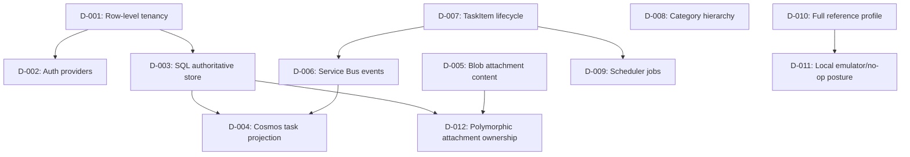

# Design Decisions - TaskFlow

This file records major design choices and dependencies made while scaffolding the TaskFlow reference app.

## Decision Dependency Graph

## Decisions

| ID | Branch | Decision | Selected Option | Depends On | Status | Rationale | Affects |
|---|---|---|---|---|---|---|---|
| D-001 | Tenancy | Tenant isolation model | Row-level tenancy | none | confirmed | Demonstrates tenant filters, tenant boundary validation, and global-admin bypass without multiplying schemas/databases. | Phase 1, Phase 2, Phase 5a, Phase 5b, Phase 5e |
| D-002 | Auth | Auth scenario | `EntraID` API auth, `EntraExternal` gateway auth, scaffold mode locally | D-001 | confirmed | Shows production auth shape while allowing local boot without cloud identity. | Phase 5e |
| D-003 | Data | Authoritative entity store | SQL Server for all authoritative entities | D-001 | confirmed | Relational joins are needed for hierarchy, task/category references, and many-to-many tags. | Phase 2, Phase 5a |
| D-004 | Data | Read model projection | Cosmos DB `TaskView` projection | D-003, D-006 | confirmed | Demonstrates denormalized query model and reconciliation pattern. | Phase 5b, post-phase hardening |
| D-005 | Storage | Attachment content store | Blob Storage | D-003 | confirmed | Binary content belongs in object storage; domain keeps metadata and URI. | Phase 2, Phase 5b |
| D-006 | Messaging | Domain event transport | Service Bus topic/queue with at-least-once semantics | D-007 | confirmed | Demonstrates event-driven projection and async host processing. | Phase 2, Phase 5b, Phase 5c |
| D-007 | Lifecycle | Task lifecycle | `Open -> InProgress -> Blocked/Completed/Cancelled`, reopen from completed/cancelled | none | confirmed | Captures realistic task workflow and supports rule tests. | Phase 1, Phase 5a |
| D-008 | Relationships | Category hierarchy depth | Self-referencing category tree, max five levels | none | confirmed | Allows business grouping while bounding query/UI complexity. | Phase 1, Phase 5a, UI |
| D-009 | Workflows | Scheduled jobs | Overdue check, recurring task generation, stale cleanup | D-007, D-006 | confirmed | Exercises scheduler, Service Bus, and domain-service reuse. | Phase 5c |
| D-010 | Profile | Reference app scope | Full scaffold, comprehensive tests, optional hosts enabled | none | confirmed | Reference app must prove every major instruction pattern. | All phases |
| D-011 | Local dependencies | Local boot strategy | Emulators where available; no-op/lazy-optional for deployment-only services | D-010 | confirmed | Scaffold must run locally without Azure provisioning. | Phase 3, Phase 5b, Phase 5e |
| D-012 | Relationships | Attachment ownership | Polymorphic `OwnerType` + `OwnerId`, no owner navigation collections | D-003, D-005 | confirmed | Avoids conflicting FK constraints for shared attachment ownership. | Phase 1, Phase 2, Phase 5a |

## Deferred Decisions

| ID | Revisit In | Blocking? | Needed Before | Notes |
|---|---|---|---|---|
| D-013 | Deployment | no | Production deployment | Live Entra, Foundry, and AI Search provisioning remain deployment-only. |

## Superseded Decisions

| ID | Superseded By | Reason |
|---|---|---|
| D-014 | D-012 | Early attachment owner navigation generated conflicting FK constraints; property-only polymorphic ownership replaced it. |

## Dependency Checklist

- [x] Tenant model closed before auth/resource partitioning.
- [x] Entity ownership closed before storage mapping.
- [x] Lifecycle states closed before events/scheduler/notifications.
- [x] External dependency modes closed before local boot strategy.
- [x] UI/API client needs closed before endpoint contract generation.
