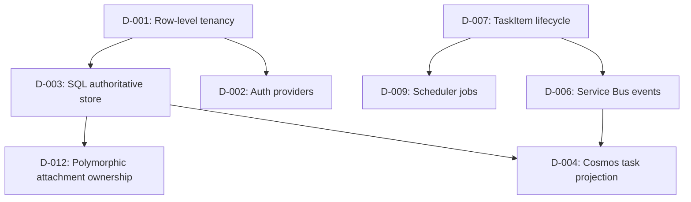

# Implementation Plan — TaskFlow

## Inputs Summary

- Domain specification: `domain-specification.yaml` (project root)
- Resource mapping: `resource-implementation.yaml` (project root)
- Ubiquitous language: `UBIQUITOUS-LANGUAGE.md`
- Design decisions: `DESIGN-DECISIONS.md`
- Mode: full | Testing: comprehensive
- scaffoldMode: full
- testingProfile: comprehensive
- Enabled hosts: API, Gateway, Scheduler, FunctionApp, UnoUI
- Enabled flags: includeApi, includeGateway, includeFunctionApp, includeScheduler, includeUnoUI, includeIaC, includeAiServices, includeArchitectureTests, includeE2ETests, includeLoadTests, includeBenchmarkTests

## Vertical Slice Order

Entities are implemented in dependency order (left-to-right):

1. **Category** — no dependencies, self-referencing hierarchy
2. **Tag** — no dependencies, simple entity
3. **TaskItem** — depends on Category (navigation), self-referencing sub-tasks
4. **Comment** — depends on TaskItem (1:M parent)
5. **ChecklistItem** — depends on TaskItem (1:M parent)
6. **Attachment** — depends on TaskItem + Comment (polymorphic join)
7. **TaskItemTag** — depends on TaskItem + Tag (M:M bridge)

## Implementation Steps

### Phase 4 — Contract Scaffolding

- [ ] Solution structure (TaskFlow.slnx, Directory.Packages.props, Directory.Build.props, global.json, nuget.config)
- [ ] All project files with correct references:
  - Domain.Model
  - Application.Contracts, Application.Models, Application.Services, Application.Mappers, Application.MessageHandlers
  - Infrastructure.Data, Infrastructure.Repositories
  - TaskFlow.Api, TaskFlow.Bootstrapper, TaskFlow.Scheduler, TaskFlow.Gateway, TaskFlow.Functions, TaskFlow.Uno
  - Aspire.AppHost, Aspire.ServiceDefaults
  - Test.Unit, Test.Integration, Test.Endpoints, Test.Architecture, Test.Support
- [ ] Interfaces: ICategoryService, ICategoryRepositoryTrxn, ICategoryRepositoryQuery, ITagService, ITagRepositoryTrxn, ITagRepositoryQuery, ITaskItemService, ITaskItemRepositoryTrxn, ITaskItemRepositoryQuery, ICommentService, ICommentRepositoryTrxn, ICommentRepositoryQuery, IChecklistItemService, IChecklistItemRepositoryTrxn, IChecklistItemRepositoryQuery, IAttachmentService, IAttachmentRepositoryTrxn, IAttachmentRepositoryQuery
- [ ] DTOs: CategoryDto, TagDto, TaskItemDto, CommentDto, ChecklistItemDto, AttachmentDto + corresponding SearchFilters
- [ ] Entity shells (properties + constructors, no domain logic)
- [ ] Test infrastructure (Test.Support with builders, UnitTestBase, InMemoryDbBuilder, DbSupport, test constants; CustomApiFactory under Test.Endpoints initially, scheduled to move to Test.Support)
- [ ] No-op DI stubs in RegisterServices.cs
- [ ] **Checkpoint:** `dotnet build` succeeds on full solution including test projects

### Phase 5a — Foundation (TDD)

Per entity (Category → Tag → TaskItem → Comment → ChecklistItem → Attachment → TaskItemTag):

- [ ] Write entity factory tests (Create method validation, required fields) — RED
- [ ] Implement entity with rich domain model (private setters, factory Create, DomainResult<T>) — GREEN
- [ ] Write domain rule tests (specifications, state machine transitions) — RED
- [ ] Implement domain rules (TaskNotOverdueSpec, CanTransitionStatusSpec, MaxSubTaskDepthSpec, ChecklistCompletionSpec, MaxActiveTasksPerTenantSpec) — GREEN
- [ ] Write builder activation tests — RED → GREEN
- [ ] Write repository CRUD tests (in-memory SQLite) — RED
- [ ] Implement EF configurations (entity configs, relationships, indexes, value objects) — GREEN
- [ ] Implement repositories (read + write, paging, filtering) — GREEN
- [ ] Implement updaters — GREEN
- [ ] Split DbContexts: TaskFlowDbContextTrxn (pooled, audit interceptor) + TaskFlowDbContextQuery (no-tracking, read-only intent)
- [ ] Pooled context factories with DbContextScopedFactory<T>
- [ ] AuditInterceptor (CreatedBy, UpdatedBy, UpdatedDate via IRequestContext)
- [ ] Tenant query filters on all ITenantEntity<Guid> entities
- [ ] Startup migration task (ApplyEFMigrationsStartup)
- [ ] Seed data for local development (sample categories, tags, tasks)
- [ ] Scaffold initial EF migration
- [ ] **Checkpoint:** `dotnet build` + `dotnet test --filter "TestCategory=Unit"` passes

### Phase 5b — App Core + Runtime/Edge (TDD for app/API, tests-after for runtime)

Per entity (same order):

- [ ] Write mapper tests (round-trip projection consistency) — RED
- [ ] Implement DTOs + mappers — GREEN
- [ ] Write service unit tests (mock repos, success/failure/not-found/conflict paths) — RED
- [ ] Implement services with caching (FusionCache named instances), domain event publishing, tenant boundary validation — GREEN
- [ ] Write structure validator tests — RED
- [ ] Implement structure validators — GREEN
- [ ] Write endpoint contract tests in `Test.Endpoints` (200/400/404/409/422, auth policies, contract shapes) — RED
- [ ] Implement minimal API endpoints — GREEN
- [ ] Implement global exception handler (DbUpdateConcurrencyException → 409, validation → 422, not-found → 404)
- [ ] Implement domain event handlers (TaskItemCreatedEventHandler, TaskItemStatusChangedEventHandler, CommentAddedEventHandler, AttachmentUploadedEventHandler)
- [ ] FusionCache integration with Redis backplane (named caches per entity, tag-based invalidation)
- [ ] Request context factory (IRequestContext<Guid, Guid> from HTTP context)
- [ ] Bootstrapper DI wiring finalized (RegisterServices.cs)

Runtime/edge concerns (tests-after, within 5b):

- [ ] Aspire AppHost with all resources:
  - SQL Server (with password parameter, persistent data volume)
  - Redis (with persistent data volume)
  - Service Bus emulator
  - Azure Storage emulator (Blob)
  - Cosmos DB emulator
- [ ] ServiceDefaults with OpenTelemetry (Activity spans, custom metrics)
- [ ] Health checks: SQL + Redis (required), `/healthz` (all) + `/readyz` (filtered)
- [ ] Service Bus message publishing + consumption (outbox pattern for DomainEvents topic)
- [ ] Blob storage for attachment upload/download (SAS URI generation)
- [ ] Cosmos DB projection store: denormalized TaskView document
- [ ] Rate limiting (per-tenant fixed window, per-endpoint sliding window)
- [ ] CORS (gateway-only)
- [ ] Security headers (X-Content-Type-Options, X-Frame-Options, Referrer-Policy)
- [ ] Resilience patterns (retry + circuit breaker + timeout on external HTTP clients)
- [ ] Configuration + appsettings (per environment, ValidateOnStart)
- [ ] Multi-tenant middleware (request context, tenant extraction from claims)
- [ ] Write infrastructure tests (health checks, config validation, caching behavior)
- [ ] **Checkpoint:** `dotnet build` + `dotnet test --filter "TestCategory=Unit|TestCategory=Endpoint"` passes; `dotnet run --project src/Aspire/AppHost` starts and all services healthy

### Phase 5c — Optional Hosts (Tests-After)

- [ ] YARP Gateway:
  - Route configuration (API forwarding)
  - User-facing auth (stub mode)
  - Claim relay via X-Orig-Request header
  - Service token acquisition (TokenService for downstream API calls)
- [ ] Scheduler host with TickerQ:
  - OverdueTaskCheck (every 6 hours)
  - RecurringTaskGeneration (daily)
  - StaleTaskCleanup (weekly)
- [ ] Function App (isolated worker):
  - ProcessTaskEvent (Service Bus topic trigger)
  - StaleTaskCleanup (timer trigger)
  - ProcessAttachment (blob trigger)
  - TaskApiProxy (HTTP trigger, read-only)
- [ ] Uno UI (WASM) — Full CRUD + Dashboard (dedicated session)
- [ ] Blazor UI alternative (if enabled)
- [ ] Write per-host smoke tests
- [ ] **Checkpoint:** each enabled host starts and responds; per-host gate status recorded in HANDOFF.md

### Phase 5d — Quality + Delivery

- [ ] Architecture tests (NetArchTest):
  - Domain.Model has no dependencies on Infrastructure or Application
  - Application.Services depends only on Application.Contracts + Domain.Model
  - Infrastructure depends on Application.Contracts + Domain.Model
  - API depends on Application.Contracts only (not Application.Services directly)
- [ ] Workflow E2E tests in `Test.E2E` (multi-endpoint chains via WebApplicationFactory + Testcontainers SQL)
- [ ] Browser UI tests in `Test.PlaywrightUI` (runs against hosted Aspire AppHost stack, not WebApplicationFactory)
- [ ] Load tests (NBomber): task CRUD throughput, search latency, p95/p99
- [ ] Benchmarks (BenchmarkDotNet): search projection, entity mapping, cache hit/miss
- [ ] Dockerfiles per host (API, Gateway, Scheduler, Functions)
- [ ] IaC (Bicep) — `infra/main.bicep` plus modules under `infra/modules/`
- [ ] CI/CD pipelines (`.github/workflows/ci.yml`, `cd.yml`)
- [ ] Vulnerability audit: `dotnet list package --vulnerable --include-transitive`
- [ ] Full regression: `dotnet test` (all categories)
- [ ] **Checkpoint:** full test suite passes; `az bicep build infra/main.bicep` succeeds

### Phase 5e — Integration (Auth + AI)

**Authentication finalization:**

- [ ] Conditional auth registration (appsettings section present → JWT Bearer; absent → no-op passthrough)
- [ ] Auth stub → real Entra ID JWT Bearer (config-driven)
- [ ] Role-based policies: GlobalAdmin bypass + tenant-matched policies (TenantMember, TenantAdmin)
- [ ] Gateway auth: user-facing (Entra External), claim relay to API
- [ ] Service-to-service tokens: Gateway → API via client credentials (TokenService)
- [ ] Claim extraction precedence: oid > NameIdentifier > sub
- [ ] Update appsettings with Entra configuration sections (commented out for scaffold mode)

**AI integration:**

- [ ] Infrastructure.AI project with search/agent service interfaces
- [ ] Azure AI Search:
  - taskitems-index definition (keyword + semantic + vector fields)
  - Search service with no-op stub when endpoint not configured
  - On-write vectorization handler (TaskItemCreated/StatusChanged → embed + index)
- [ ] Agent:
  - TaskAssistant (ChatClientAgent) with function tools:
    - SearchTasks, CreateTask, UpdateTask, GetTaskDetails, SummarizeTasks
  - System prompt from external file (prompts/task-assistant.md)
  - Grounded retrieval (RAG) via taskitems-index
  - Per-user conversation scoping, no cross-tenant leakage
- [ ] Aspire resource wiring: AddAzureAISearch(), AddAzureOpenAI()
- [ ] Bootstrapper DI registration (lazy-optional: no config → no-op)
- [ ] API endpoints: /api/search/tasks, /api/agent/chat
- [ ] Configuration: Foundry endpoint, model deployment names, search index name in appsettings
- [ ] **Checkpoint:** authenticated endpoints respond correctly; app boots without AI config (no-op stubs); search + agent work when Azure AI resources configured

## Open Questions

All resolved — no outstanding questions.

## Decision Dependency Graph

## Decisions Log

| # | Decision | Rationale |
|---|---|---|
| 1 | SQL for all entities | Relational joins needed for hierarchical categories, self-referencing tasks, M:M tags |
| 2 | Cosmos DB for TaskView projection | Denormalized read-optimized document; demonstrates document-first aggregates + reconciliation |
| 3 | Blob storage for attachments | Binary content → blob; SAS URI for direct client upload/download |
| 4 | Service Bus for domain events | At-least-once delivery, outbox pattern, topic/subscription model |
| 5 | FusionCache + Redis | L1 memory + L2 distributed cache with fail-safe; named instances per entity |
| 6 | .NET 10 | Latest framework; all packages at latest versions |
| 7 | TaskItem self-referencing max 3 levels | Domain rule enforced; keeps queries/UI manageable |
| 8 | Category self-referencing max 5 levels | Business requirement for organizational hierarchy depth |
| 9 | Comprehensive testing profile | Reference app demonstrates all test types |
| 10 | All emulators | No Azure subscription required; clone-and-run via Aspire |

## Tooling & Environment Readiness

CLI tools were preferred before MCP servers where both existed. MCP and documentation lookup were used for project-specific service/library guidance.

### Required CLIs

| Tool | Needed for | Phase | Install | Verified |
|---|---|---|---|---|
| `dotnet-ef` | EF migrations | 5a | `dotnet tool install dotnet-ef` | [x] |
| `azd` | IaC/deployment validation | 5d | `winget install Microsoft.Azd` | [ ] |
| `func` | Azure Functions local validation | 5c | `npm i -g azure-functions-core-tools@4` | [ ] |
| `uno-check` | Uno workload validation | 5c | `dotnet tool install -g uno.check` | [ ] |

### EF.Packages Feed Readiness

- `nuget.config` exists and contains `nuget.org`.
- `nuget.config` uses packageSourceMapping for EF.Packages private-feed isolation.
- Local restore requires `NUGET_AUTH_TOKEN` or an approved credential provider.
- `Directory.Packages.props` owns EF.* package versions.
- Project-level EF.* package references do not carry local `Version` attributes.
- Validation command: `python .instructions/scripts/validate-ef-packages-feed.py --root . --config-only --require-auth-env`.

### Recommended MCP Servers

| Server | Phases | Why | Available |
|---|---|---|---|
| Microsoft Docs MCP | all | .NET, Azure, Aspire, Functions, auth docs | [x] |
| GitHub MCP | 4-5 | Reference app/source lookup | [x] |
| Azure MCP | 3, 5b, 5d, 5e | Azure resource and IaC validation | [ ] |
| Playwright MCP | 5c, 5d | UI/E2E validation | [ ] |

### Online Resources

| Library/Service | Phase | Resource | URL |
|---|---|---|---|
| TickerQ | 5c | Package docs and samples | `https://github.com/Arcenox-co/TickerQ` |
| FusionCache | 5b | Package docs and samples | `https://github.com/ZiggyCreatures/FusionCache` |
| Uno Platform | 5c | Official docs | `https://platform.uno/docs/articles/intro.html` |
| NetArchTest | 5d | GitHub README | `https://github.com/BenMorris/NetArchTest` |

## Risk / Blockers

| Risk | Mitigation |
|---|---|
| Cosmos DB emulator stability | Fallback: Cosmos features can be disabled via lazy-optional config |
| Service Bus emulator limitations | Fallback: in-process channel dispatch for local dev |
| AI services not available locally | No-op stubs; functional only when Azure AI resources configured |
| Uno UI WASM bundle size | Use ahead-of-time (AOT) compilation, tree-shaking |
