# TaskFlow - Technical Design Document

> **Audience**: Developers onboarding to the project  
> **Last updated**: May 2026

---

## Table of Contents

1. [Overview](#1-overview)
2. [C4 Architecture Diagrams](#2-c4-architecture-diagrams)
3. [Software Architecture Layers](#3-software-architecture-layers)
4. [Service Topology](#4-service-topology)
5. [Domain Model](#5-domain-model)
6. [Data Flow Diagrams](#6-data-flow-diagrams)
7. [API Contract Summary](#7-api-contract-summary)
8. [Security Model](#8-security-model)
9. [Deployment Topology](#9-deployment-topology)
10. [Observability](#10-observability)
11. [Audit Strategy](#11-audit-strategy)
12. [Testing Strategy](#12-testing-strategy)
13. [UI Architecture](#13-ui-architecture)
14. [Workflow Orchestration (FlowEngine)](#14-workflow-orchestration-flowengine)

---

## 1. Overview

TaskFlow is a **multi-tenant task management reference application** built on .NET 10 and .NET Aspire. It demonstrates production-grade patterns for building cloud-native distributed systems with Azure backing services.

### Tech Stack

| Layer | Technology |
|-------|-----------|
| **Orchestration** | .NET Aspire (local dev + cloud deployment) |
| **API** | ASP.NET Core Minimal APIs |
| **Application Layer** | Selectable Service or CQRS implementation (`Application:Style`; default `Service`) |
| **Gateway** | YARP Reverse Proxy |
| **Background Jobs** | Azure Functions (isolated worker v4), TickerQ Scheduler |
| **UI** | Uno Platform WASM (MVUX), Blazor WASM/Server (MudBlazor, Refit) |
| **Database** | SQL Server (EF Core, dual DbContext) |
| **Cache** | Redis (FusionCache with L1/L2 + backplane) |
| **Messaging** | Azure Service Bus (topics + queues) |
| **Read Model** | Azure Cosmos DB (denormalized projections) |
| **File Storage** | Azure Blob Storage |
| **AI** | Azure AI Search + Azure OpenAI (stubs) |
| **Workflow Orchestration** | EF.FlowEngine 1.0.104 - SQL state store, outbox, circuit breaker, admin API, Blazor dashboard |
| **Auth** | Microsoft Entra ID (External) / Scaffold mode |
| **Observability** | OpenTelemetry (OTLP), Aspire Dashboard |
| **Testing** | MSTest, Moq, NetArchTest, WebApplicationFactory, Testcontainers.MsSql, Aspire.Hosting.Testing, Stryker.NET, BenchmarkDotNet, NBomber, Playwright |

### Design Principles

- **Domain-Driven Design** - Aggregates, value objects, domain events, bounded contexts
- **Selectable Application Style** - Same Domain, Infrastructure, UI, DTO contracts, and HTTP routes can run through the default Service layer or direct CQRS handlers
- **CQRS-like** - Separate read/write DbContexts; denormalized Cosmos read model alongside normalized SQL
- **Multi-Tenant First** - Tenant isolation at query filter, service, and authorization layers
- **Event-Driven** - Integration events flow through Service Bus to Azure Functions for async processing
- **Config-Driven Auth** - Single build, multiple deployment profiles (dev scaffold vs Entra ID prod)
- **Emulator-Ready** - All Azure services run as local emulators via Aspire; no cloud account needed for development

---

## 2. C4 Architecture Diagrams

### 2.1 System Context Diagram

Shows the TaskFlow system boundary, its users, and external dependencies.

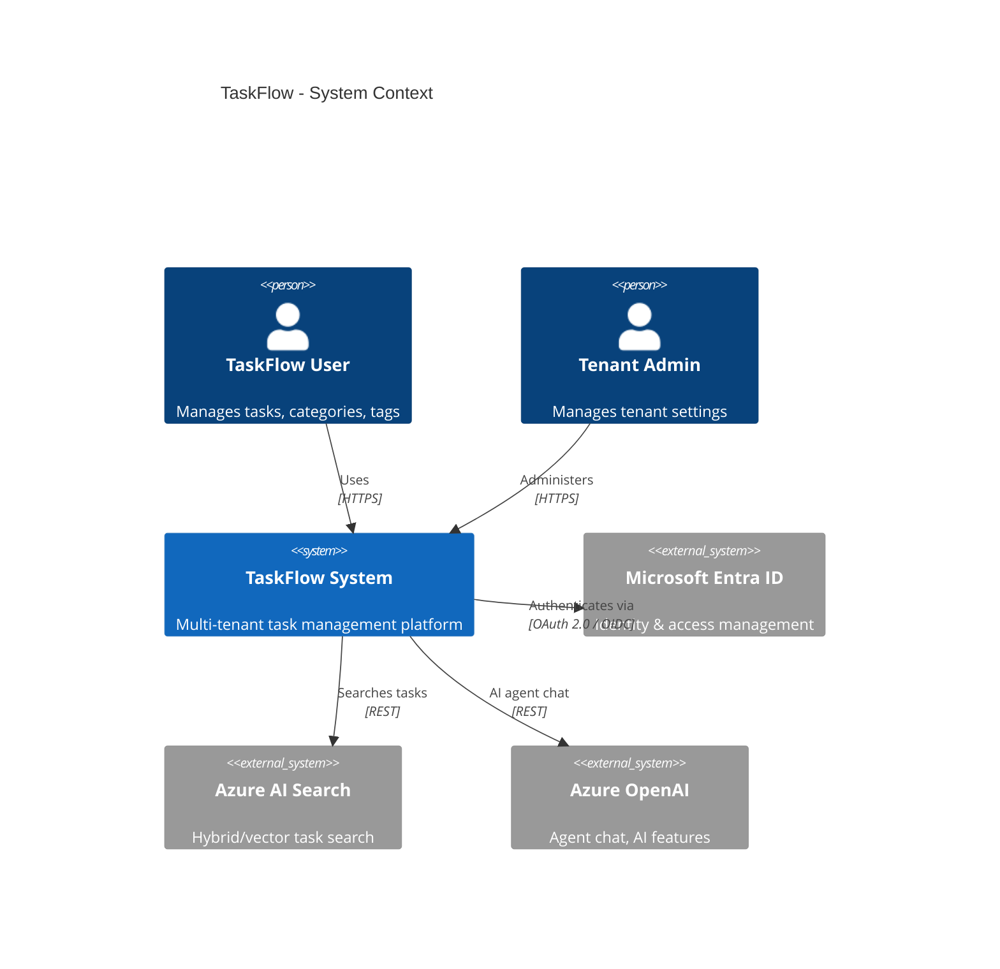

> **Diagram legend:** Solid lines = direct dependency. Labels describe the protocol or relationship.

### 2.2 Container Diagram

All deployable units and infrastructure resources with their relationships.


> **Diagram legend:** All relationships shown as solid arrows with protocol labels. Blue containers = compute services, orange containers = data/messaging platform services, purple containers = frontend UI. Solid arrows = read/write. Dashed arrows = secondary r/w. Dotted arrows = async trigger.

### 2.3 Component Diagram - TaskFlow API

Internal structure of the core API service.

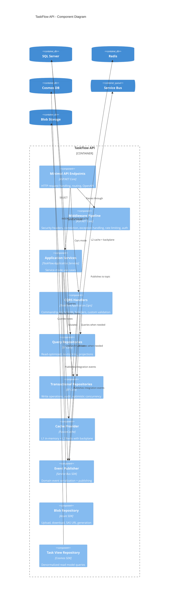

> **Diagram legend:** Arrows indicate direct dependencies. Components inside the API boundary reference each other; external containers represent infrastructure backing services.

---

## 3. Software Architecture Layers

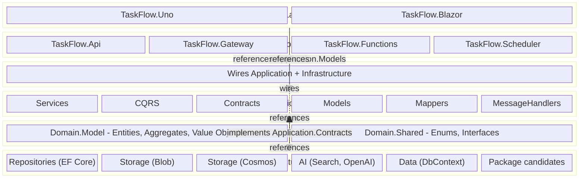

> **Legend:** Solid blue arrows = project references. Orange `implements` = Infrastructure implementing Application.Contracts interfaces. Dotted arrows = DI wiring (Bootstrapper wires layers at runtime, not a compile-time reference).

### Layer Responsibilities

| Layer | Projects | Responsibility | May Reference |
|-------|----------|---------------|---------------|
| **UI** | TaskFlow.Uno, TaskFlow.Blazor | User interfaces - Uno MVUX + Kiota; Blazor MudBlazor + Refit | Application.Models (shared contract) |
| **Host** | Api, Gateway, Functions, Scheduler | HTTP pipeline, function triggers, config | Bootstrapper |
| **Bootstrapper** | TaskFlow.Bootstrapper | DI composition root - wires all layers (not a layer itself; referenced by Hosts and Tests). Also owns FlowEngine registration (`RegisterServices.FlowEngine.cs`) and FE-migration startup task. | Application, Infrastructure |
| **Application** | Services, Cqrs, Contracts, Models, Mappers, MessageHandlers | Use-case implementation for the selected style, validation, DTO mapping, tenant enforcement, integration event definitions. `MessageHandlers` also defines `IWorkflowTrigger` for invoking FlowEngine workflows from domain events. | Domain |
| **Domain** | Domain.Model, Domain.Shared | Entities, aggregates, value objects, enums, marker interfaces | Nothing (no outward deps) |
| **Infrastructure** | Repositories, Data, Storage, AI, EF.CQRS, EF.AspNetCore.Reference, EF.Test.Integration | EF Core, Azure SDK implementations of Application.Contracts interfaces. `EF.CQRS`, `EF.AspNetCore.Reference`, and `EF.Test.Integration` are separately packaged helper candidates under Infrastructure for now. `Data` also owns the FlowEngine state DbContext (`TaskFlowFlowEngineDbContext`) and its migrations. | Application.Contracts, Domain |

### Application Style Switch

TaskFlow can run the same public API contract through either application-layer style. The switch is startup-time configuration, not per-request dispatch.

| Setting | Behavior |
|---------|----------|
| `Application:Style` | `Service` or `Cqrs`; missing/blank defaults to `Service` |
| `TASKFLOW_APPLICATION_STYLE` | Environment override used by local test runs and forwarded by Aspire to API, Scheduler, and Functions |
| `Service` | Registers the existing `I*Service` implementations and maps the service endpoint set |
| `Cqrs` | Registers `TaskFlow.Application.Cqrs` command/query handlers plus decorators and maps the CQRS endpoint set |
| Public contract | Routes, DTOs, envelopes, auth, audit, infrastructure repositories, and UI clients remain unchanged |

`TaskFlow.Api` contains two endpoint sets. Service endpoints inject `I*Service`. CQRS endpoints inject the exact `IRequestHandler<TRequest,TResponse>` needed by that route, construct a command/query record, and call `HandleAsync` directly. The avoided patterns are central request dispatchers, request buses, and generic `Send()` entrypoints. The reason is traceability: each route exposes the exact request and handler registration it uses, so tests and code review can follow the use case without hidden runtime routing.

`src/Infrastructure/EF.CQRS` is intentionally isolated as the package candidate. It provides `ICommand`, `IQuery`, `IRequestHandler`, request validators, validation/logging decorators, and `AddDecoratedRequestHandler(...)` DI helpers. The project has no TaskFlow business logic.

`src/Infrastructure/EF.AspNetCore.Reference` is temporarily renamed so the reference app can still consume the existing `EF.AspNetCore` feed package. It hosts reusable ASP.NET Core conventions: versioned API/OpenAPI registration, versioned route-group helpers, correlation ID middleware, security headers, and ProblemDetails metadata. `src/Infrastructure/EF.Test.Integration` hosts reusable integration-test conventions: WebApplicationFactory EF rewiring, SQL Testcontainers fixtures, Aspire health/connection-string helpers, and scoped environment-variable handling.

### Service vs CQRS Tradeoffs

| Style | Pros | Cons | Best Fit |
|-------|------|------|----------|
| `Service` | Familiar, compact, fewer files, easy to scan for simple CRUD and shared workflows | Services can grow broad over time; one class may accumulate several endpoint flows | Small-to-medium CRUD modules, teams that value fewer moving parts |
| `Cqrs` | One request/handler per use case; endpoint-to-handler flow is explicit; custom validation/decorator pipeline is easy to test | More files and registrations; can be ceremony for simple CRUD; needs guardrails against hiding use cases behind generic dispatch | Use cases with distinct validation, branching, audit, event, or query/write behavior |

### Dependency Rules (Architecture-Test Enforced)

- **Domain** has zero references to Application, Infrastructure, or Host layers
- **Application.Services** has zero references to Infrastructure or Host layers
- **Application.Cqrs** has zero references to Host layers or Infrastructure implementation projects; it may reference the isolated `EF.CQRS` package candidate
- **Infrastructure** implements `Application.Contracts` interfaces (not Domain contracts)
- CQRS guardrails: avoid central request dispatchers, request buses, and generic `Send()` entrypoints; one command/query maps to one handler registration so wiring remains explicit
- All tenant entities implement `ITenantEntity<Guid>`
- All services have corresponding interfaces in Contracts
- Entity properties use private setters (encapsulation)

---

## 4. Service Topology

A clean representation of the Aspire-orchestrated service graph (equivalent to the Aspire dashboard graph view):


> **Legend:** Solid arrows = direct synchronous dependency ("read/write"). Dotted arrows = asynchronous/event-driven trigger (the service doesn't call directly; infrastructure triggers it via subscription or blob event). Dashed arrows = secondary read/write.

### Hosted Services

| Service | Project | Purpose | Key Dependencies |
|---------|---------|---------|-----------------|
| **API Gateway** | `TaskFlow.Gateway` | Auth boundary, YARP reverse proxy, claims injection | API |
| **TaskFlow API** | `TaskFlow.Api` | Core business logic, CRUD, integration events, FlowEngine admin REST (`/api/flowengine/*`), workflow JSON seeding | SQL, Redis, Cosmos, Service Bus, Blob, FlowEngine state DB |
| **Azure Functions** | `TaskFlow.Functions` | Async event processing, blob processing, timer cleanup | SQL, Cosmos, Service Bus, Blob |
| **Task Scheduler** | `TaskFlow.Scheduler` | Cron jobs via TickerQ (overdue checks, recurring tasks, cleanup) | SQL, Redis, Service Bus |
| **Uno WASM App** | `TaskFlow.Uno` | Cross-platform UI (browser + desktop + mobile) - Uno Platform MVUX | Gateway |
| **Blazor App** | `TaskFlow.Blazor` | Interactive Server UI - MudBlazor, Refit client, full CRUD; also hosts the FlowEngine Dashboard + Designer pages (routes contributed by `EF.FlowEngine.Dashboard` via `AdditionalAssemblies`) | Gateway -> API + FlowEngine admin |

---

## 5. Domain Model

### 5.1 Entity Relationship Diagram

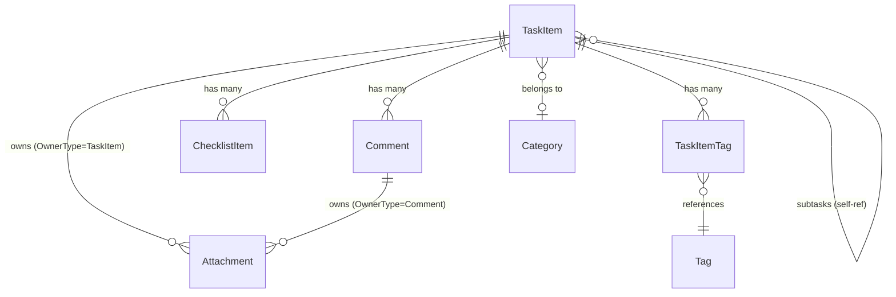

**Polymorphic Attachment ownership:** `Attachment` uses a discriminator pattern (`OwnerType` enum + `OwnerId` GUID) instead of separate foreign keys. `OwnerType` is either `TaskItem` or `Comment`, and `OwnerId` points to the owning entity's `Id`. This avoids multiple nullable FKs and allows any entity type to own attachments.


### 5.2 Base Entity

All entities inherit from `EntityBase` (NuGet: `EF.Domain`) which provides:

| Property | Type | Purpose |
|----------|------|---------|
| `Id` | `Guid` | Primary key |
| `RowVersion` | `byte[]` | Optimistic concurrency token |

> **Note:** `EntityBase` does **not** define audit properties (`CreatedAt`, `CreatedBy`, `UpdatedAt`, `UpdatedBy`). Soft-delete (`IsDeleted`) is defined on individual domain entities that support it, not on `EntityBase`. All audit/timestamp tracking is handled by the `AuditInterceptor` - see [Section 11: Audit Strategy](#11-audit-strategy).

All tenant entities also implement `ITenantEntity<Guid>` - enforcing `TenantId` on every row.

### 5.3 Value Objects

| Value Object | Properties | Used By |
|-------------|-----------|---------|
| **DateRange** | `StartDate`, `DueDate` (both `DateTimeOffset?`) | `TaskItem` |
| **RecurrencePattern** | Recurrence interval, frequency, end conditions | `TaskItem` (EF owned type) |

### 5.4 Integration Events

Events are defined in `Application.Contracts.Events` (not Domain layer). Published via `IIntegrationEventPublisher` to Service Bus.

| Event | Trigger | Downstream Effect |
|-------|---------|-------------------|
| `TaskItemCreatedEvent` | New task created | Service Bus -> Functions -> Cosmos projection |
| `TaskItemStatusChangedEvent` | Status transition | Service Bus -> Functions -> Cosmos projection |
| `TaskItemCompletedEvent` | Status -> Completed | Notifications (future) |
| `TaskItemRescheduledEvent` | Date range updated | Recalculation (future) |
| `TaskItemOverdueSuspectedEvent` | Scheduler detects overdue | Escalation (future) |
| `CommentAddedEvent` | New comment on task | Notifications (future) |
| `AttachmentUploadedEvent` | File uploaded | Metadata extraction via Functions |

---

## 6. Data Flow Diagrams

### 6.1 Request Flow - CRUD Operation

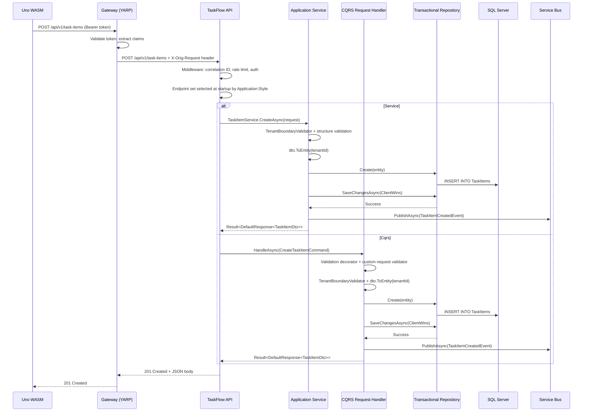

The CQRS path is direct endpoint-to-handler invocation. Decorators are assembled by DI around the exact handler type; there is no central dispatch step.

### 6.2 Event Processing Flow - Cosmos Projection

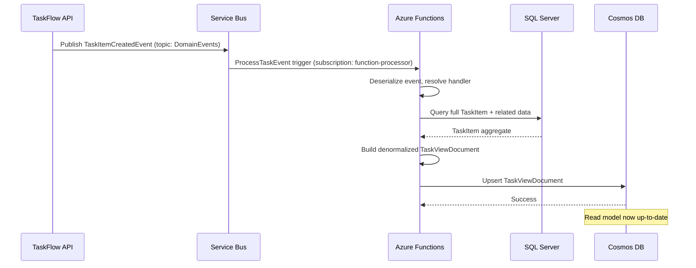

### 6.3 Attachment Upload Flow

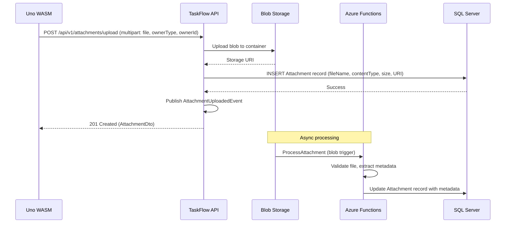

### 6.4 Caching Flow - FusionCache L1/L2

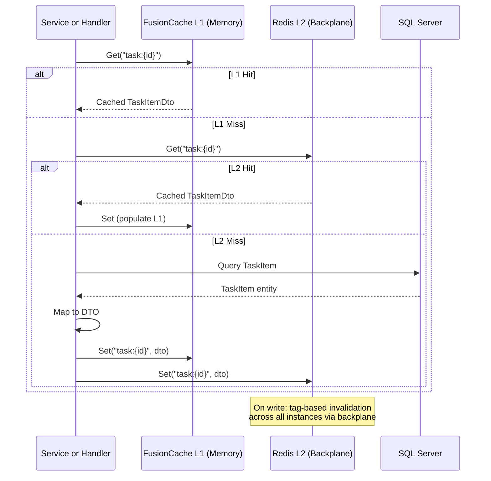

---

## 7. API Contract Summary

**Route versioning boundary:** business/domain HTTP contracts are versioned under `/api/v1/*`. Operational, health, gateway, and workflow-admin surfaces are intentionally unversioned: `/health/*`, `/alive`, `/healthz`, `/api/flowengine/*`, and the Azure Functions host health route `/api/health`. Versioning applies to the API contract consumed by clients, not to host-management probes or third-party/admin surfaces with their own lifecycle.

### 7.1 Entity Endpoints (Consistent CRUD Pattern)

| Method | Route | Purpose |
|--------|-------|---------|
| `POST` | `/api/v1/{entity}/search` | Paged search with filters and sorting |
| `GET` | `/api/v1/{entity}/{id}` | Get single entity by ID |
| `POST` | `/api/v1/{entity}` | Create new entity |
| `PUT` | `/api/v1/{entity}/{id}` | Update existing entity |
| `DELETE` | `/api/v1/{entity}/{id}` | Delete entity |

**Entities with full CRUD**: `task-items`, `categories`, `tags`, `comments`, `checklist-items`, `attachments`  
**Entities with partial CRUD**: `task-item-tags` (create, get, delete - no search/update)

### 7.1.1 Endpoint Implementation Sets

HTTP routes and DTO contracts do not change when the application style changes. `TaskFlow.Api` selects one endpoint implementation set during startup:

| Style | Endpoint implementation | Dependency shape |
|-------|-------------------------|------------------|
| `Service` | `Endpoints/*Endpoints.cs` (excluding `Endpoints/Cqrs`) | Endpoints inject `I*Service` interfaces from `Application.Contracts` |
| `Cqrs` | `Endpoints/Cqrs/*` | Endpoints inject the route-specific `IRequestHandler<TRequest,TResponse>` and call `HandleAsync` directly |

This keeps generated clients, gateway routing, UIs, auth policies, ProblemDetails behavior, and E2E tests stable while demonstrating both application-layer designs.

### 7.2 Special Endpoints

| Method | Route | Purpose |
|--------|-------|---------|
| `POST` | `/api/v1/attachments/upload` | Multipart file upload (file, ownerType, ownerId) |
| `GET` | `/api/v1/search/tasks` | AI-powered hybrid search (`?query=...&mode=hybrid&maxResults=10`) |
| `POST` | `/api/v1/agent/chat` | AI agent chat endpoint |
| `GET` | `/api/v1/task-views` | Cosmos DB denormalized views (`?tenantId=...&pageSize=20`) |
| `GET` | `/api/v1/task-views/{id}` | Single task view (`?tenantId=...`) |
| `*` | `/api/flowengine/*` | FlowEngine admin API - instances, registry, circuit-breakers, human tasks. Mounted via `MapFlowEngineAdmin(prefix: "/api/flowengine")`; see [Section 14 Workflow Orchestration](#14-workflow-orchestration-flowengine) |
| `GET` | `/health/memory` | Anonymous memory health probe |
| `GET` | `/health/db` | Authenticated database health probe |
| `GET` | `/health/full` | Authenticated full probe, optionally including external dependencies |
| `GET` | `/alive` | Liveness probe |

The Azure Functions app keeps the Functions host default `/api` prefix. Its business HTTP triggers mirror the public versioned contract (`/api/v1/*`); its host health trigger remains `/api/health`.

### 7.3 OpenAPI Documents

OpenAPI is available when `OpenApiSettings:Enable=true`. The JSON document route is `GET /openapi/{documentName}.json`; the current baseline document is `GET /openapi/v1.json`.

`ApiContract.SupportedDocuments` is the source of truth for registered OpenAPI documents. Each document is registered separately and filtered by the API Explorer group name, so simultaneous endpoint versions can coexist: a v1-only endpoint appears in `/openapi/v1.json`, a v2-only endpoint appears in `/openapi/v2.json` once `v2` is added, and shared endpoints can opt into both versions. Scalar is mapped by `MapScalarApiReference()` when OpenAPI is enabled.

### 7.4 Request/Response Envelopes

```
DefaultRequest<TDto>         -> Wraps a DTO for create/update operations
DefaultResponse<TDto>        -> Single entity response with metadata
SearchRequest<TFilter>       -> Paged search: Page, PageSize, SortBy, SortDirection, Filter
PagedResponse<TDto>          -> Items[] + TotalCount + pagination metadata
Result<T>                    -> Success | Failure(errors) | None (404)
```

### 7.5 Middleware Pipeline (Order of Execution)

```
1. SecurityHeadersMiddleware       - Adds security response headers
2. CorrelationIdMiddleware         - Generates/propagates X-Correlation-Id
3. HeaderPropagation               - Captures X-Correlation-Id for outgoing HttpClient calls
4. ExceptionHandler                - Catches exceptions -> ProblemDetails with trace/activity metadata
5. RateLimiter                     - Per-tenant API limits plus tiered health limits
6. CORS                            - Policy TaskFlowUi for allowed origins
7. Authentication                  - Scaffold (dev) or JWT Bearer (Entra ID)
8. Authorization                   - Authenticated fallback/default policy plus named policies
9. GatewayClaimsTransformer        - Rehydrates X-Orig-Request only from configured trusted gateway app id
10. OpenAPI / Scalar UI            - API documentation (if enabled)
11. Health + Alive endpoints       - /health/memory, /health/db, /health/full, /alive
12. Versioned Entity Endpoints     - /api/v1/*
```

---

## 8. Security Model

### 8.1 Authentication Modes

| Mode | Environment | Mechanism |
|------|-------------|-----------|
| **Scaffold** | Development | Predictable test identity; all requests succeed; no real token validation |
| **Entra ID** | Production | JWT Bearer validation against Microsoft Entra External ID tenant |

The mode is config-driven (`AuthMode` in `appsettings.json`), allowing a single build to serve both environments.

### 8.2 Multi-Tenancy Enforcement

Tenant isolation is enforced at **three levels**:

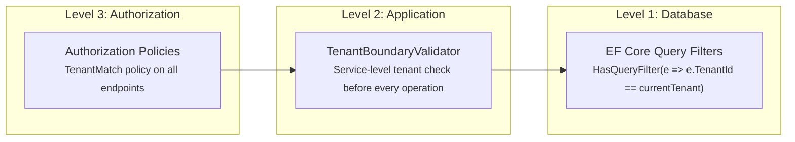

- **Query Filters**: Every `ITenantEntity<Guid>` has an automatic EF Core query filter scoped to the current tenant. Cross-tenant data is invisible at the SQL level.
- **Service Validation**: `TenantBoundaryValidator` checks every service call to prevent tenant leakage, even for operations that bypass query filters.
- **Authorization Policies**: Middleware-level enforcement before requests reach services.

### 8.3 Authorization Policies

| Policy | Purpose |
|--------|---------|
| `GlobalAdmin` | System-wide admin operations |
| `TenantMatch` | Request tenant must match authenticated user's tenant |
| `TenantAdmin` | Admin within a specific tenant |
| `StatusTransition` | Controls who can transition task statuses |

Fallback and default authorization require an authenticated principal for every endpoint unless the route is explicitly anonymous. Scaffold mode supplies a predictable local principal; production uses JWT bearer validation.

### 8.4 Gateway Claims Flow

```
User -> Gateway: Bearer {user-token}
Gateway: Validate token (Entra or scaffold)
Gateway: Acquire service-to-service token
Gateway -> API: Authorization: Bearer {service-token}
              + X-Orig-Request: Base64({ oid, tenant_id, name, roles })
API: GatewayClaimsTransformer verifies azp/appid == GatewayClaimsTransform:GatewayAppId
API: GatewayClaimsTransformer extracts X-Orig-Request
API: Sets IRequestContext (tenant, user, roles)
```

### 8.5 Rate Limiting

Per-tenant fixed window: **100 requests per minute** by default for versioned API routes. Health endpoints use separate IP-based policies: memory/alive is generous, db is tighter, and full is strict because it can include expensive dependency probes. Returns `429 Too Many Requests`.

---

## 9. Deployment Topology

### 9.1 Local Development (Aspire)

All infrastructure runs as persistent emulators - no Azure subscription required.

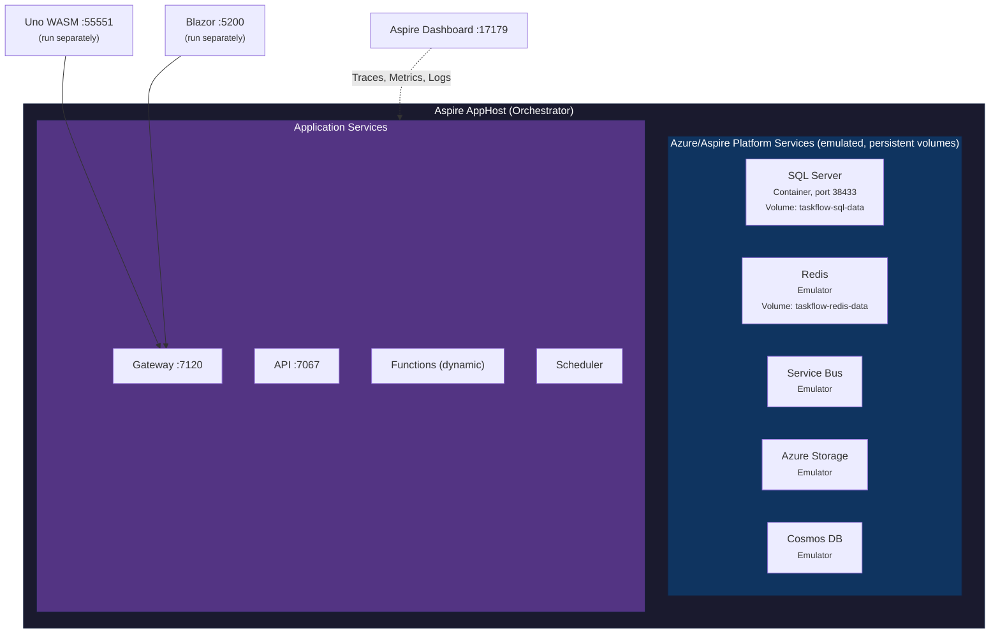

**Start locally**:
```bash
dotnet run --project src/Aspire/AppHost
# Uno WASM and Blazor (with FlowEngine Dashboard) run separately
```

**Service dependencies**: API waits for SQL + Redis. Gateway waits for API. Functions wait for SQL + Storage.

**Startup tasks (Development / Aspire only)**: on first boot the API runs two `IStartupTask` implementations from `TaskFlow.Bootstrapper`:

1. `ApplyEFMigrationsStartup` - applies app-schema migrations against `TaskFlowDbContextTrxn`.
2. `ApplyFlowEngineMigrationsStartup` - applies the FlowEngine `flowengine` schema migrations against `TaskFlowFlowEngineDbContext` (separate migration history table `__EFMigrationsHistory_FlowEngine`).

Both are gated on `ASPNETCORE_ENVIRONMENT=Development` or an Aspire signal and log-and-continue on failure so a missing local DB does not block boot. In production migrations run via the deployment pipeline, not at startup.

After migrations apply, the FlowEngine workflow-seeding hosted service (`AddWorkflowJsonSeeding`) walks `TaskFlow.Api/Workflows/*.json` and upserts each definition into the registry (idempotent - skips existing versions). See [Section 14.3](#143-shipped-workflows) for the three workflows shipped.

### 9.2 Cloud Deployment (Azure)

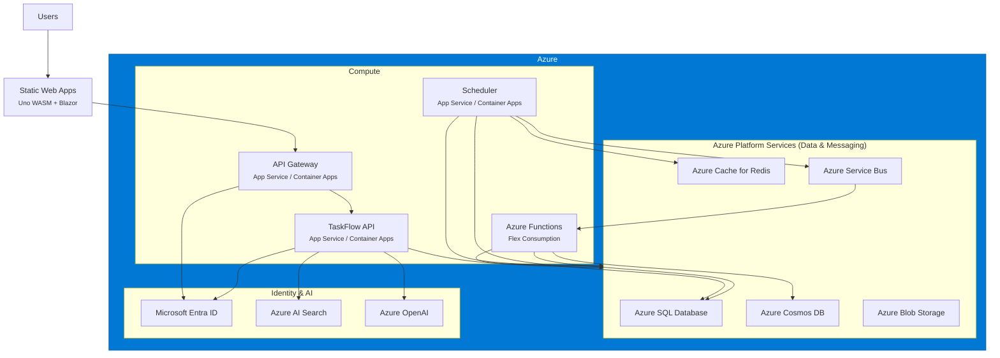

---

## 10. Observability

### 10.1 OpenTelemetry

Configured via **Aspire Service Defaults** (`Extensions.cs`):

| Signal | Instrumentation |
|--------|----------------|
| **Traces** | ASP.NET Core, HttpClient, custom spans |
| **Metrics** | ASP.NET Core, HttpClient, .NET Runtime, FusionCache |
| **Logs** | Structured logging with `IncludeFormattedMessage` + scopes |
| **Exporter** | OTLP (to Aspire Dashboard locally, Azure Monitor in cloud) |

### 10.2 Health Checks

| Endpoint | Source | Purpose | Checks |
|----------|--------|---------|--------|
| `/healthz` | ServiceDefaults | Liveness | All registered checks |
| `/readyz` | ServiceDefaults | Readiness | Checks tagged `"ready"` |
| `/health/memory` | API/Gateway | Cheap liveness-style probe | Memory/self checks |
| `/health/db` | API | Authenticated persistence probe | Checks tagged `"db"` |
| `/health/full` | API/Gateway | Authenticated full probe | Checks tagged `"full"`; external dependencies only when `HealthChecks:EnableExternalServices=true` |
| `/alive` | API | Simple liveness | Always returns 200 |

### 10.3 Correlation Tracking

- `CorrelationIdMiddleware` generates or propagates `X-Correlation-Id` on every request
- Correlation ID flows through: HTTP headers -> service calls -> integration events -> Function triggers -> logs
- Enables end-to-end distributed tracing across all services

### 10.4 Aspire Dashboard

Locally at `http://localhost:17179`:
- Resource graph (all services + infra)
- Structured logs with filtering
- Distributed traces (request -> service -> database)
- Metrics (throughput, latency, errors)

### 10.5 FlowEngine Dashboard

Hosted inside `TaskFlow.Blazor` via `AddFlowEngineDashboard(adminApiBaseUrl: ...)`. Provides a separate, workflow-centric observability surface that complements the Aspire dashboard:

| Page | Purpose |
|------|---------|
| `/workflows/registry` | Active / draft workflow definitions, versions, status |
| `/workflows/new` | Visual designer canvas (`Z.Blazor.Diagrams`) - drag-drop node editing, JSON import/export |
| `/workflows/run` | Manual instance start (pick a workflow, paste params, fire) |
| `/instances` | Running / suspended / completed / faulted instances; click-through to history |
| `/human-tasks` | Open human tasks, claim/approve/reject UI |
| `/circuit-breakers` | Per-key breaker state (closed / half-open / open) |

The dashboard talks to the API over HTTPS via the gateway (`/api/flowengine/*`). Page routes are contributed by the `EF.FlowEngine.Dashboard` assembly through `Routes.razor`'s `AdditionalAssemblies`.

---

## 11. Audit Strategy

### 11.1 Overview

TaskFlow uses an **EF Core SaveChanges interceptor** pattern for entity-level auditing. The `AuditInterceptor<string, Guid?>` (from NuGet package `EF.Data.Interceptors`) intercepts the transactional DbContext and publishes audit records via the internal message bus.

> **Important:** `EntityBase` does **not** define audit properties (`CreatedAt`, `CreatedBy`, `UpdatedAt`, `UpdatedBy`). All audit persistence flows through the interceptor -> message bus -> repository pipeline described below.

### 11.2 Audit Flow

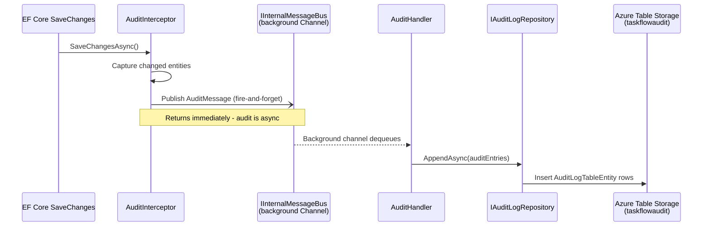

> The `IInternalMessageBus` uses a `System.Threading.Channels` background task. The interceptor enqueues the audit message and **returns immediately**, so `SaveChangesAsync()` is not blocked by audit persistence.

### 11.3 AuditLogTableEntity Schema

| Field | Type | Description |
|-------|------|-------------|
| `Id` | `string` | Unique audit record ID |
| `AuditId` | `string` | Correlation ID grouping related changes |
| `TenantId` | `string` | Tenant identifier |
| `EntityType` | `string` | CLR type name of the audited entity |
| `EntityKey` | `string` | Primary key of the audited entity |
| `Action` | `string` | `Insert`, `Update`, or `Delete` |
| `Status` | `string` | Outcome status |
| `StartTimeTicks` | `long` | Operation start (ticks) |
| `ElapsedTimeTicks` | `long` | Duration (ticks) |
| `RecordedUtc` | `DateTimeOffset` | When the audit was recorded |
| `Metadata` | `string` | Serialized property changes / extra context |
| `Error` | `string` | Error details (if failed) |

**Partition/Row key strategy:** `PartitionKey` = tenant ID (or `"_system"` for non-tenant operations); `RowKey` = reverse-ticks for newest-first queries.

### 11.4 Fallback

When Azure Table Storage is unavailable (e.g., local dev without emulator), the DI container registers `NoOpAuditLogRepository`, which silently discards audit entries.

> **FlowEngine outbox is a separate concern.** The `AuditInterceptor` audits **application** entities (TaskItem, Comment, etc.) and writes to Azure Table Storage. FlowEngine has its own outbox (`flowengine.Outbox`) that stages `message` / `integration` / `agent` side effects produced by workflow nodes; it is persisted by the **same** `SaveChangesAsync` that writes the workflow execution row (atomic save+enqueue - see [Section 14.4](#144-state-isolation--atomic-outbox)). The two outboxes do not overlap: app-side mutations go through the audit pipeline; workflow-side mutations go through the FE outbox.

### 11.5 Key Source Files

| File | Purpose |
|------|---------|
| `TaskFlow.Bootstrapper/Registration/RegisterServices.Database.cs` | Registers `AuditInterceptor` on Trxn DbContext |
| `TaskFlow.Application.MessageHandlers/AuditHandler.cs` | Handles audit messages from internal bus |
| `TaskFlow.Application.Contracts/Storage/IAuditLogRepository.cs` | Repository contract |
| `TaskFlow.Infrastructure.Storage/AuditLogRepository.cs` | Azure Table Storage implementation |
| `TaskFlow.Infrastructure.Storage/AuditLogTableEntity.cs` | Table entity mapping |
| `TaskFlow.Infrastructure.Storage/NoOpAuditLogRepository.cs` | No-op fallback |

---

## 12. Testing Strategy

### 12.1 Test Pyramid

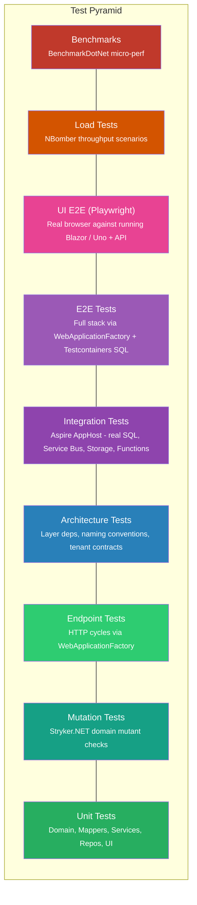

### 12.2 Test Projects

| Project | Purpose | Value | Primary Tools |
|---------|---------|-------|---------------|
| **Test.Unit** | Pure-CPU verification of domain logic, DTO <-> entity mapping, application service and CQRS handler success/failure/conflict paths, custom CQRS validation, in-memory repository CRUD, and Uno API-service mappers. | Fastest feedback loop - millisecond runs, zero infrastructure. Catches regressions in pure logic before slower suites are touched. | MSTest, **Moq**, EF Core InMemory provider |
| **Test.Mutation** | Focused MSTest project for Stryker.NET runs against selected domain files (`TaskItem.cs`, `TaskItemStatusTransitionRule.cs`). Samples assert boundary values, failure messages, status transitions, optional-link updates, and idempotent child collections. | Demonstrates mutation testing without running the full solution suite. Stryker verifies that assertions kill comparison, boolean, string, and collection-behavior mutants in the configured domain scope. | MSTest, **Stryker.NET** |
| **Test.Endpoints** | Drives every HTTP endpoint through the full ASP.NET Core pipeline in both application styles and asserts status codes (200/201/400/404/409/422), envelopes, and ProblemDetails shapes. | Confirms the wire contract stays identical across service endpoints and CQRS endpoints without paying for real infrastructure. | MSTest, `Microsoft.AspNetCore.Mvc.Testing` (**WebApplicationFactory**), EF Core InMemory |
| **Test.Architecture** | Asserts compile-time layering and naming rules: Domain has zero outward references; `Application.Services` cannot reference Infrastructure or Hosts; `Application.Cqrs` has no Host or Infrastructure implementation dependency; CQRS avoids central request dispatchers, request buses, and generic `Send()` entrypoints; every tenant entity implements `ITenantEntity<Guid>`; services have matching `I*` interfaces; entity setters are private. | Architectural drift is caught by CI rather than by a future code review. Rules are expressed in fluent C#, run with `dotnet test`, and travel with the code instead of living in a wiki. | MSTest, **NetArchTest.Rules** |
| **Test.Integration** | End-to-end verification of cross-service workflows by booting the full **Aspire AppHost** in-process: SQL Server, Service Bus emulator, Azure Table Storage, and (when `func.exe` is on PATH) Azure Functions. Covers EF migrations, repository CRUD with paging, the audit pipeline (interceptor -> channel -> table storage), and domain-event flow (API publish -> Service Bus -> Function projection -> audit row). | Highest-fidelity tests that still run on a developer laptop. Shared Aspire health, connection-string, and environment-scope helpers come from `EF.Test.Integration`, keeping the assembly fixture focused on TaskFlow-specific AppHost setup. | MSTest, **Aspire.Hosting.Testing** (`DistributedApplicationTestingBuilder`), `EF.Test.Integration`, `Azure.Data.Tables` |
| **Test.E2E** | Multi-endpoint workflow tests (create -> search -> update -> delete) against a real SQL Server container in both application styles. These cover cases where the InMemory provider's missing semantics (FK constraints, projection plans, concurrency tokens) would hide bugs. | Bridges Test.Endpoints (fast, in-memory) and Test.Integration (full AppHost). The SQL container fixture and options factory come from `EF.Test.Integration`, so E2E tests only choose the application style and database backend. | MSTest, WebApplicationFactory, `EF.Test.Integration` |
| **Test.Load** | NBomber HTTP scenarios - task-search throughput and CRUD generation - with assertions on success rate (>= 95 %) and P99 latency (< 2 s). Manual reports write under `src/Test/Test.Load/load-reports`. | Catches pre-prod throughput regressions and gives a reproducible perf baseline. Tests are `[Ignore]`'d by default (manual run) so they never gate CI on infra availability. | MSTest, **NBomber**, NBomber.Http |
| **Test.Benchmarks** | BenchmarkDotNet console runner exercising hot-path mappers (`ToDto`, `ToEntity`) and application-style endpoint paths (`SearchTaskItemsAsync`, `CreateTaskItemAsync`) with `[MemoryDiagnoser]`. | Quantifies mapping allocation cost and compares Service vs CQRS endpoint overhead behind the same HTTP contract. | **BenchmarkDotNet**, WebApplicationFactory, EF Core InMemory |
| **Test.Support** | TaskFlow-specific test infrastructure: a thin `WebApplicationFactoryBase<TProgram, TTrxn, TQuery>` adapter over `EF.Test.Integration`, fluent entity builders (`CategoryBuilder`, `TaskItemBuilder`, `CommentBuilder`, `TagBuilder`), shared constants. | Shared DI-rewiring boilerplate lives in the package candidate; Test.Support keeps only TaskFlow-specific startup-task removal and fixture data. | `EF.Test.Integration`, EF Core InMemory |
| **Test.PlaywrightUI** | Browser-driven UI tests against the running Blazor (`https://localhost:7201`) and Uno WASM (`https://localhost:7069`) frontends - full CRUD lifecycle (create -> edit -> delete), dashboard smoke, regression scenarios. | The only suite that actually clicks the UI. Catches binding errors, MudBlazor / Uno render bugs, and broken navigation that all server-side tests miss. | **Playwright** (TypeScript, `@playwright/test`) |
| **Test.Integration.FlowEngine** | Workflow-definition validity tier for every JSON file shipped under `TaskFlow.Api/Workflows/`. Asserts JSON -> `WorkflowDefinition` deserialization, `WorkflowDefinitionValidator.ValidateAndThrow` passes (unknown node types, dangling edges, malformed schemas), in-memory `IWorkflowRegistry` round-trip preserves node count + status, `WorkflowDefinitionBuilder.FromJson` hydrates id/version/nodes, and the copy-on-build glob does not silently drop files. | Catches authoring mistakes that would otherwise only surface at first-instance-start in dev. Runs without any Aspire stack or Docker - uses `EF.FlowEngine.Testing`'s in-memory registry. Fast (sub-second) and is the first line of defense on every PR that touches a workflow JSON. | MSTest, **EF.FlowEngine.Testing** (`InMemoryWorkflowRegistry`) |

### 12.2.1 Application Style Coverage

Endpoint and E2E workflow suites run against both `ApplicationStyle.Service` and `ApplicationStyle.Cqrs` by overriding `Application:Style`/`TASKFLOW_APPLICATION_STYLE` in the test host. The same HTTP routes, request/response envelopes, ProblemDetails shapes, auth behavior, and database side effects must pass in both modes.

CQRS-specific unit tests cover handler behavior, the custom `IRequestValidator<TRequest>` pattern, validation failure response mapping, and decorator order. Architecture tests guard the CQRS boundary: no central request dispatcher, no request bus, no generic `Send()` entrypoint, no Host dependency, no Infrastructure implementation dependency, and one request record per handler registration.

`ApplicationStyleBenchmarks` extends that parity check into performance. It creates isolated in-memory API hosts for `Service` and `Cqrs`, disables rate-limit noise through test configuration, seeds identical task data, then benchmarks search and create endpoints through the same HTTP routes.

### 12.2.2 Mutation Testing Scope

`Test.Mutation` is intentionally narrow. Its `stryker-config.json` mutates `TaskFlow.Domain.Model` only for `TaskItem.cs` and `TaskItemStatusTransitionRule.cs`, filters tests to `TestCategory=Mutation`, and emits progress, cleartext, and HTML reports. This makes the sample fast enough for local learning while keeping the report focused on domain invariants rather than framework wiring.

Run from repo root:

```powershell
rtk dotnet tool restore
rtk dotnet test src/Test/Test.Mutation/Test.Mutation.csproj
```

Run Stryker from `src/Test/Test.Mutation`:

```powershell
rtk dotnet tool run dotnet-stryker
```

### 12.3 Testing Tools

| Tool | Role | What It Provides |
|------|------|------------------|
| **MSTest** | Test runner (Microsoft) | `[TestClass] / [TestMethod] / [TestCategory]`, `Assert.*`, parallelization (`MSTestParallelize{Assembly,TestClasses}`), `[AssemblyInitialize]` / `[AssemblyCleanup]` for shared fixtures. |
| **Moq** | Mocking framework | Lambda-based fakes for service interfaces (`Mock<IFoo>`); used in `Test.Unit` to isolate services from repositories and external clients. |
| **NetArchTest.Rules** | Architecture assertion DSL | Fluent rules over reflected assemblies - `Types.InAssembly(asm).ShouldNot().HaveDependencyOnAny(...).GetResult()`. Failure surfaces the offending types. Run as ordinary MSTest cases. |
| **Stryker.NET** | Mutation testing | Mutates selected source files, reruns the matching MSTest cases, and reports killed, survived, no-coverage, and compile-error mutants. Configured through `src/Test/Test.Mutation/stryker-config.json`. |
| **BenchmarkDotNet** | Micro-benchmark harness | Warmup / iteration control, statistical noise rejection, `[MemoryDiagnoser]` for GC allocations, console summary tables. Run as `dotnet run -c Release --project src/Test/Test.Benchmarks`. |
| **NBomber + NBomber.Http** | Load-test framework | `Scenario.Create(...)`, `Simulation.Inject(rate, interval, during)` for arrival-rate load, percentile assertions on latency / success. HTTP helpers for request building. |
| **`Microsoft.AspNetCore.Mvc.Testing`** | In-process API host (**WebApplicationFactory**) | Boots `Program.cs` against a `TestServer` - full DI, middleware, routing, model binding - without Kestrel. Returns an `HttpClient` and exposes the `IServiceCollection` for test-time service replacement. |
| **Testcontainers** (`Testcontainers.MsSql`) | Ephemeral Docker containers | Spawns SQL Server 2025 in a throwaway container per fixture; tests use the real engine with no manual install. Disposes the container automatically. |
| **Aspire.Hosting.Testing** | AppHost in-process orchestration | `DistributedApplicationTestingBuilder.CreateAsync(typeof(AppHostProgram))` boots the whole resource graph (SQL, Service Bus, Storage, Functions) in one call. `app.GetConnectionStringAsync(...)` and `app.CreateHttpClient(...)` return wired clients. |
| **Playwright** (`@playwright/test`) | Cross-browser automation | Headless Chrome/Firefox/WebKit, auto-waiting locators, `screenshot: "only-on-failure"`, `trace: "on-first-retry"`. Driven from a TypeScript `playwright.config.ts`. |

### 12.4 Test.Support and `EF.Test.Integration`

`EF.Test.Integration` centralizes the reusable WebApplicationFactory plumbing that would otherwise be re-implemented in every HTTP test project. `Test.Support` keeps a TaskFlow-specific adapter so tests do not need to know the package project's startup-task convention:

```csharp
public abstract class WebApplicationFactoryBase<TProgram, TTrxnContext, TQueryContext>
    : EfWebApplicationFactoryBase<TProgram, TTrxnContext, TQueryContext>
    where TProgram : class
    where TTrxnContext : DbContextBase<string, Guid?>
    where TQueryContext : DbContextBase<string, Guid?>
{
    protected override string? StartupTaskServiceTypeFullName => "TaskFlow.Bootstrapper.IStartupTask";
}
```

| Concern | How it's handled |
|---------|------------------|
| **Hosted services** | `EF.Test.Integration` strips `IHostedService` registrations so tests never start TickerQ jobs, Service Bus listeners, or background workers by accident. |
| **Startup tasks** | `Test.Support` sets the TaskFlow startup-task service type to remove migrations/seeding startup tasks from WebApplicationFactory hosts. |
| **Pooled DbContext** | `EF.Test.Integration` removes pooled context descriptors, scoped factories, `IDbContextFactory`, audit interceptors, and connection no-lock interceptors. |
| **DbContext construction** | `EfTestDbContextFactory<T>` builds contexts via reflection, side-stepping `required` members on `DbContextBase`. |
| **DB choice** | Subclass overrides `BuildTrxnOptions()` / `BuildQueryOptions()`; `DbContextOptionsFactory` provides InMemory and SQL Server helpers. |

Concrete subclasses are tiny:

```csharp
// Test.Endpoints - fast, in-memory
public sealed class CustomApiFactory
    : WebApplicationFactoryBase<Program, TaskFlowDbContextTrxn, TaskFlowDbContextQuery>
{
    private readonly string _dbName = $"TestDb_{Guid.NewGuid()}";
    protected override DbContextOptions BuildTrxnOptions()  =>
        new DbContextOptionsBuilder<TaskFlowDbContextTrxn>().UseInMemoryDatabase(_dbName).Options;
    protected override DbContextOptions BuildQueryOptions() =>
        new DbContextOptionsBuilder<TaskFlowDbContextQuery>().UseInMemoryDatabase(_dbName).Options;
}

// Test.E2E - real SQL via EF.Test.Integration
public sealed class SqlApiFactory
    : WebApplicationFactoryBase<Program, TaskFlowDbContextTrxn, TaskFlowDbContextQuery>
{
    private static readonly MsSqlContainerFixture Sql = new();

    public static Task StartContainerAsync() => Sql.StartAsync();

    protected override DbContextOptions BuildTrxnOptions()  =>
        DbContextOptionsFactory.BuildSqlServerOptions<TaskFlowDbContextTrxn>(Sql.ConnectionString);

    protected override DbContextOptions BuildQueryOptions() =>
        DbContextOptionsFactory.BuildSqlServerOptions<TaskFlowDbContextQuery>(Sql.ConnectionString);
}
```

**Why a package candidate:** every HTTP test project (Endpoints, E2E) needs the same surgical DI rewiring. Centralising it in `EF.Test.Integration` means a fix for an interceptor or pooled-context bug applies to all suites and can be reused by other solutions.

#### `WebApplicationFactory` itself

`Microsoft.AspNetCore.Mvc.Testing.WebApplicationFactory<TProgram>` boots the application's `Program.cs` against an in-memory `TestServer`. The full ASP.NET Core pipeline runs (auth, middleware, routing, endpoint binding, exception handling, ProblemDetails) but no socket is opened - calls go through `factory.CreateClient()`, an `HttpClient` wired to the `TestServer`. The factory exposes `ConfigureWebHost(...)` so tests can replace services in the same DI container the host uses, which is how this codebase swaps SQL Server for InMemory or container-backed SQL.

### 12.5 Choosing the Right Host: WebApplicationFactory vs Testcontainers vs Aspire.Hosting.Testing

The three approaches are complementary, not competing - pick by the boundary you want to test:

| Aspect | WebApplicationFactory | Testcontainers | Aspire.Hosting.Testing |
|--------|----------------------|----------------|------------------------|
| **What it boots** | One ASP.NET Core app in-process | One Docker container per resource (SQL, Redis, etc.) | The whole `AppHost` graph in-process - every service + every backing resource Aspire knows about |
| **Networking** | None (TestServer) | Real TCP via Docker | Real TCP between Aspire-managed services |
| **Process model** | Single test process | Test process + N Docker containers | Test process + Aspire orchestrator + N containers / emulators |
| **Startup cost** | < 1 s | Seconds (container pull / start) | Tens of seconds (whole graph) |
| **DI override** | Trivial - same `IServiceCollection` | N/A (configure container, then connection-string into your code) | Limited - you get connection strings & HTTP clients; you don't reach inside other services |
| **Test isolation** | Per-factory instance | Per-fixture container | Shared via `[AssemblyInitialize]` (one Aspire app per test assembly) |
| **Used in this repo** | `Test.Endpoints`, `Test.E2E` (composed with Testcontainers) | `Test.E2E` (`SqlApiFactory`) | `Test.Integration` (`AspireTestHost`) |

**When to reach for which:**

- **WebApplicationFactory** - endpoint contract tests, ProblemDetails shapes, auth / authz routing, anything where the API is the system under test and the database layer can be substituted.
- **Testcontainers** - workflows that depend on real RDBMS semantics (FK cascades, optimistic concurrency, EF projection plans) but only need *one* backing service.
- **Aspire.Hosting.Testing** - multi-service workflows: API publishes a domain event -> Service Bus -> Function consumes -> Cosmos projection -> Azure Table audit row appears. No other tool wires that graph for you with a one-liner.

`DistributedApplicationTestingBuilder.CreateAsync(typeof(AppHostProgram))` reflectively loads the AppHost's `Program` type and invokes its `Main` against a builder configured for testing. The resulting `DistributedApplication` exposes `GetConnectionStringAsync(name)` and `CreateHttpClient(serviceName)` to talk to any resource - including ones gated behind environment flags (e.g., `TASKFLOW_INCLUDE_FUNCTIONS=true` in `AspireTestHost` to include the Functions host only when `func.exe` is present on the developer's PATH).

**Aspire test-host best practices** - `AspireTestHost` codifies the canonical recipe from `learn.microsoft.com/dotnet/aspire/testing`:

- Bound every async Aspire call with `.WaitAsync(DefaultTimeout, ct)` (build, start, `GetConnectionStringAsync`, `WaitForResourceHealthyAsync`) so a hung container or stuck DCP step fails fast instead of hanging the run.
- Gate test work on `app.ResourceNotifications.WaitForResourceHealthyAsync(name, ct)` - a resource reaching `Running` does not mean it accepts connections (SQL warm-up, Functions cold-start, Azurite first request).
- Pass parameters via `configureBuilder: (appOptions, hostSettings) => hostSettings.Configuration["Parameters:sql-password"] = ...` instead of mutating process env vars; the AppHost picks them up through normal `IConfiguration` binding.
- Set `appOptions.DisableDashboard = true` (default in the testing builder, but explicit beats implicit).
- Quiet framework chatter with `builder.Services.AddLogging(l => { l.SetMinimumLevel(Information); l.AddFilter("Microsoft.AspNetCore", Warning); l.AddFilter("Aspire.", Warning); })`.

**Aspire tier by reuse** - `Test.Integration` also hosts three classes that only need a single backing service (`MigrationAndRepositoryTests`, `DomainEventPipelineTests`, `AuditLogRepositoryAzuriteTests`). Per the comparison above they would qualify for Testcontainers, but the project piggybacks them on `AspireTestHost`'s shared SQL/Azurite resources rather than starting a parallel Testcontainers stack - saving the second container per assembly. Class-level `<summary>` blocks call this out on each so the choice doesn't read as drift.

### 12.6 Test.PlaywrightUI

A standalone TypeScript Playwright project that drives the **running** UI and API in a real browser. It is *not* `dotnet test`-orchestrated - it lives outside the .NET solution and runs via `npm`.

**Project layout**

```
Test.PlaywrightUI/
--- package.json              # @playwright/test ^1.59.1
--- playwright.config.ts      # Two projects: 'blazor' and 'uno'
--- tests/
-   --- blazor/task-crud.spec.ts
-   --- uno/
-       --- task-crud.spec.ts
-       --- taskflow-task-list-regression.spec.ts
-       --- taskflow-ui.spec.ts
--- utils/
    --- blazorTestUtils.ts    # MudBlazor-aware helpers (.mud-table, .mud-dialog, ...)
    --- unoTestUtils.ts
```

**Two browser projects**, configured in `playwright.config.ts`:

| Project | `baseURL` | Tests against |
|---------|-----------|---------------|
| `blazor` | `https://localhost:7201` | Blazor MudBlazor app |
| `uno` | `https://localhost:7069` | Uno Platform WASM app |

Both projects use Desktop Chrome, ignore HTTPS errors (self-signed dev cert), capture screenshots on failure, and record traces on first retry. `workers: 1` and `mode: "serial"` in spec files keep state-dependent CRUD steps in order.

**Prerequisites - Playwright drives a real browser, so the full vertical slice must be running before you run the suite:**

1. **API** - `dotnet run --project src/Host/Aspire/AppHost` boots SQL, Service Bus, Storage, the API, the Gateway, and seed data.
2. **UI** - depending on the project being tested:
   - Blazor at `https://localhost:7201` (`dotnet run --project src/UI/TaskFlow.Blazor`)
   - Uno WASM at `https://localhost:7069` (run separately - Uno SDK constraint)
3. **Browsers** - `npx playwright install --with-deps chromium` (one-time).

**Running**

```bash
cd src/Test/Test.PlaywrightUI
npm install
npm run test:blazor          # Blazor project only
npm run test:uno             # Uno project only
npm run test                 # Both
npm run test:full:fast       # No retries, max 4 failures, 120 s timeout - for local triage
```

**How a test reads.** `blazorTestUtils.ts` encodes MudBlazor's selectors so specs stay readable:

```typescript
await waitForApp(page);                              // GET /tasks, wait for heading
await navigateToNewTask(page);                       // click "New Task" -> wait for editor
await fillTextField(page, "Title", uniqueTitle("E2E-Create"));
await selectOption(page, "Status", "In Progress");   // MudSelect popover dance
await clickSave(page);
await expectSnackbar(page, "saved");                 // .mud-snackbar
await expectTaskInTable(page, taskTitle);            // .mud-table-body
```

**What this catches.** Server-side suites cannot observe binding errors, missing `@onclick` wiring, broken MudDialog renders, Uno XAML resource errors, or the dialog-confirm-then-API-call sequence. Playwright drives the entire stack the user touches - UI, Gateway, API, database - so any broken link in that chain surfaces as a failed step with a screenshot and trace.

### 12.7 Running Tests

```bash
# Unit + architecture (fast, no infrastructure)
dotnet test --filter "TestCategory=Unit|TestCategory=Architecture"

# Endpoint contract tests (in-memory DB, no Docker)
dotnet test src/Test/Test.Endpoints

# E2E tests (Docker required - Testcontainers SQL)
dotnet test src/Test/Test.E2E

# Integration tests (boots Aspire AppHost - Docker + emulators)
dotnet test --filter "TestCategory=Integration"

# Load tests (manual - needs API host running on localhost:5000)
dotnet test --filter "TestCategory=Load"

# Benchmarks (Release build, console runner)
dotnet run -c Release --project src/Test/Test.Benchmarks

# UI E2E (requires Blazor and/or Uno running, plus API + seed data)
cd src/Test/Test.PlaywrightUI && npm run test
```

---

## 13. UI Architecture

### 13.1 Uno Platform WASM (Primary UI)

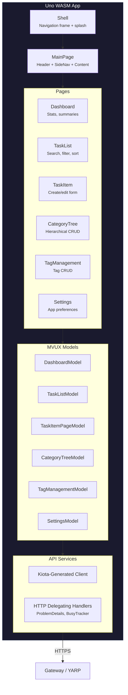

**Key patterns**:

| Pattern | Implementation |
|---------|---------------|
| **MVUX** | Uno's Model-View-Update-eXtended - reactive state management |
| **Kiota Client** | Auto-generated HTTP client from OpenAPI spec |
| **Mock Mode** | `Features:UseMocks=true` -> canned 15-task dataset, no network calls |
| **Form Guard** | `IFormGuard` prevents navigation away from unsaved edits |
| **Navigation** | PanelVisibilityNavigator swaps sibling panels; detail pages push onto frame stack |

### 13.2 Blazor WASM/Server UI

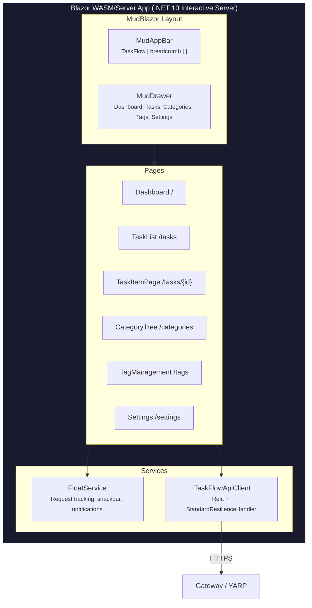

`TaskFlow.Blazor` is a fully-built **.NET 10 Interactive Server** application using **MudBlazor** components and a **Refit** HTTP client (`ITaskFlowApiClient`) with `AddStandardResilienceHandler()`. It connects to the API through the YARP Gateway.

**Layout:** MudAppBar (hamburger toggle, "TaskFlow" title, breadcrumb via `FloatService.ModuleName`, progress spinner, dark mode toggle) + MudDrawer (nav: Dashboard, Tasks, Categories, Tags, Settings).

**Pages:**

| Route | Page | Purpose |
|-------|------|---------|
| `/` | Dashboard | Overview stats |
| `/tasks` | TaskList | Search, filter, sort tasks |
| `/tasks/new` | TaskItemPage | Create new task |
| `/tasks/{Id:guid}` | TaskItemPage | Edit task (checklist/comments CRUD, dirty-check) |
| `/categories` | CategoryTree | Hierarchical category CRUD |
| `/tags` | TagManagement | Tag CRUD |
| `/settings` | Settings | App preferences |
| `/Error` | Error | Error display |

**Key patterns:**

| Pattern | Implementation |
|---------|---------------|
| **Component Library** | MudBlazor - Material Design components |
| **HTTP Client** | Refit-generated typed client (`ITaskFlowApiClient`) |
| **Resilience** | `AddStandardResilienceHandler()` (Microsoft.Extensions.Http.Resilience) |
| **FloatService** | Centralized request tracking, snackbar error display, change notifications |
| **Dirty Check** | Form change tracking with navigation guard |

### 13.3 Gateway as BFF

The YARP Gateway acts as a **Backend-for-Frontend (BFF)**:
- Handles user authentication (Entra ID or scaffold)
- Acquires service-to-service tokens for downstream API calls
- Injects `X-Orig-Request` with user claims for the API
- CORS configured for UI origins

---

## 14. Workflow Orchestration (FlowEngine)

TaskFlow embeds **EF.FlowEngine 1.0.104** as a long-running, durable, human-in-the-loop orchestration runtime for AI-driven scenarios. It complements - does not replace - the existing CRUD API, domain events, and TickerQ scheduler:

- **Domain events + Service Bus + Functions** still own per-event side effects (Cosmos projection, AI search indexing, blob processing).
- **TickerQ scheduler** still owns timer-driven cron jobs (overdue checks, recurring task generation, stale cleanup).
- **FlowEngine** owns multi-step, stateful, branching workflows that need to wait - for an AI agent, for a human approval, for a downstream call - and resume on the same instance across process restarts.

### 14.1 Why FlowEngine

| Capability | What it gives the reference app |
|---|---|
| **Stateful suspend/resume** | A workflow waiting on a 24-hour human approval survives API restarts, deploys, and scale-out. |
| **AI agent nodes** | `agent` node type wraps Azure OpenAI with output-schema validation, retry, idempotency keys, prompt versioning. |
| **Human task nodes** | `human` node type produces durable records (assignee role, due date, quorum, escalation) consumed by the dashboard's human-task UI. |
| **Saga compensation** | `compensationNodeId` on a node provides an inverse action invoked when a later node in the same instance faults. |
| **Atomic outbox** | `message` / `integration` / `agent` side effects are staged in the same `SaveChangesAsync` that persists workflow state - no torn-write between state save and external dispatch. |
| **Circuit breaker** | Per-key durable breaker state survives replicas/restarts so a single instance failing doesn't reset the breaker for the others. |
| **Admin API + Dashboard** | Out-of-box REST + Blazor UI for registry / instances / human tasks / breakers - operators don't have to build their own. |

### 14.2 Packages and Layer Placement

All 13 FlowEngine packages are pinned at the same version in `Directory.Packages.props`:

| Package | Project that references it | Purpose |
|---|---|---|
| `EF.FlowEngine` | Bootstrapper, App.MessageHandlers, Test.Integration.FlowEngine | Core runtime: engine, executor pipeline, definition model, built-in node executors (auto-registered in 1.0.104). |
| `EF.FlowEngine.StateStore.Sql` | Infrastructure.Data | `IFlowEngineStateDbContext` mixin + `SqlExecutionStateStore`. |
| `EF.FlowEngine.Locks.Sql` | Bootstrapper | SQL-backed distributed lock provider for engine sweeps + leases. |
| `EF.FlowEngine.WorkflowRegistry.Sql` | Bootstrapper, Infrastructure.Data | `IWorkflowRegistry` over SQL. |
| `EF.FlowEngine.HumanTaskStore.Sql` | Bootstrapper, Infrastructure.Data | Human-task durable queue. |
| `EF.FlowEngine.Outbox.Sql` | Bootstrapper, Infrastructure.Data | `IFlowEngineOutboxDbContext` mixin - atomic state+outbox save. |
| `EF.FlowEngine.CircuitBreaker.Sql` | Bootstrapper, Infrastructure.Data | `IFlowEngineCircuitBreakerDbContext` mixin - durable breaker state. |
| `EF.FlowEngine.Clients.Http` | Bootstrapper | Resilient HTTP client for `integration` nodes. |
| `EF.FlowEngine.Clients.ServiceBus` | Bootstrapper | Service Bus client for `message` nodes. |
| `EF.FlowEngine.Clients.OpenAI` | Bootstrapper | Azure OpenAI client for `agent` nodes. |
| `EF.FlowEngine.AdminApi` | Bootstrapper, TaskFlow.Api | REST endpoints under `/api/flowengine/*` + auth policies. |
| `EF.FlowEngine.Dashboard` | TaskFlow.Blazor | Blazor pages (registry, designer, run, instances, human tasks, breakers). |
| `EF.FlowEngine.Testing` | Test.Integration.FlowEngine | In-memory registry and helpers for fast unit/integration tests. |

Registration entry point: `RegisterServices.FlowEngine.cs` (`TaskFlow.Bootstrapper`), called from `RegisterApplicationServices()` after the AI services. The DI surface composes engine + state + locks + registry + human-task + outbox + circuit-breaker + connector clients + JSON seeding + admin policies in a single fluent chain.

### 14.3 Shipped Workflows

Three workflow JSONs ship under `TaskFlow.Api/Workflows/` and are seeded at startup by the FlowEngine hosted seeding service:

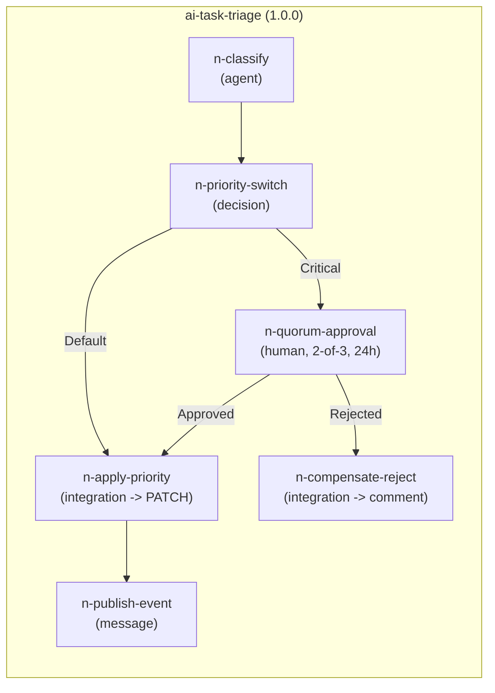

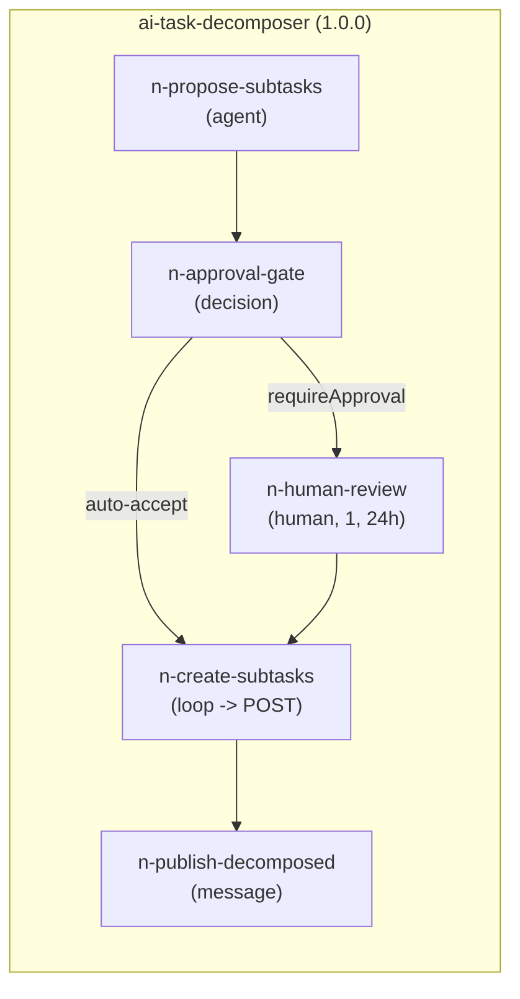

```mermaid
graph LR
    subgraph compliance["compliance-check (1.0.0)"]
        C1["n-query-due<br/>(query: tag=compliance, due&lt;windowDays)"] --> C2["n-loop-each<br/>(parallel, max 5)"]
        C2 --> C3["n-fetch-evidence<br/>(document)"]
        C3 --> C4["n-extract<br/>(agent)"]
        C4 --> C5["n-decide<br/>(decision)"]
        C5 -->|"expired"| C6["n-escalate<br/>(human, compliance-officer, 48h)"]
        C5 -->|"due-soon"| C7["n-remind<br/>(message comment)"]
    end
```

| Workflow | Trigger | Params | Notable patterns |
|---|---|---|---|
| **ai-task-triage** | Manual today; intended to fire on `TaskItemCreatedEvent` via `IWorkflowTrigger` (see Section 14.6) | `tenantId`, `taskId`, `description` (required) | 2-of-3 human quorum, 12 h escalation, saga `compensationNodeId` revert on downstream fault, idempotency keys on every side-effect node |
| **ai-task-decomposer** | Manual / dashboard | `tenantId`, `taskId`, `description`, `requireApproval` (optional) | Conditional human review, sequential `loop` to create N children via API |
| **compliance-check** | Manual / dashboard / future cron via TickerQ | `tenantId`, `windowDays` (default 7) | Parallel `loop` with bounded concurrency (max 5), `query` node using FilterBuilder, `document` node for evidence retrieval |

All three are validated at every build by `Test.Integration.FlowEngine` (see Section 12.2).

### 14.4 State Isolation & Atomic Outbox

FlowEngine state lives in a **separate `flowengine` schema on the same SQL Server connection**, owned by `TaskFlowFlowEngineDbContext` (sealed, in `Infrastructure.Data`). This is **Variant A** of the deployment-layout decision (same DB, separate schema):

```mermaid
graph TB
    subgraph sql["SQL Server (single instance, single connection string)"]
        subgraph app["dbo schema"]
            A1[("TaskItems")]
            A2[("Categories, Tags, ...")]
            A3[("__EFMigrationsHistory")]
        end
        subgraph fe["flowengine schema"]
            F1[("Workflows")]
            F2[("Executions")]
            F3[("HumanTasks")]
            F4[("ChildSignals")]
            F5[("Outbox")]
            F6[("CircuitBreakers")]
            F7[("__EFMigrationsHistory_FlowEngine")]
        end
    end

    TRX["TaskFlowDbContextTrxn"] --> app
    QRY["TaskFlowDbContextQuery"] --> app
    FECTX["TaskFlowFlowEngineDbContext<br/>(IFlowEngineStateDbContext<br/>+ IFlowEngineOutboxDbContext<br/>+ IFlowEngineCircuitBreakerDbContext)"] --> fe

    style app fill:#0078d4,stroke:#005a9e,color:#fff
    style fe fill:#8e44ad,stroke:#6c3483,color:#fff
```

**Why a separate DbContext rather than mixing FlowEngine entities into the existing transactional context:**

- TaskFlow's primary DbContext (`TaskFlowDbContextTrxn`) inherits from `EF.Data.DbContextBase<TUser,TKey>` for the audit interceptor. FlowEngine's mixin contexts (`FlowEngineOutboxDbContext`, etc.) are abstract bases - multi-inheritance is impossible.
- FlowEngine's interface-composition pattern (`IFlowEngineStateDbContext` + `IFlowEngineOutboxDbContext` + `IFlowEngineCircuitBreakerDbContext`) lets a single fresh DbContext declare all three roles without subclass conflict. `TaskFlowFlowEngineDbContext` is that DbContext.
- Separate migration history (`__EFMigrationsHistory_FlowEngine`, configured in `ConfigureFlowEngineSqlOptions`) keeps the two schemas evolvable independently.

**Atomic outbox is preserved.** Because state, outbox, and circuit-breaker tables all live in `TaskFlowFlowEngineDbContext`, FlowEngine's `SqlExecutionStateStore.SaveWithOutboxAsync` writes the workflow execution row and the outbox rows in a single `SaveChangesAsync`. There is no window where a node's external side effect is committed without the state advance, or vice versa. This is the gain over Variant B/C (separate DB) and is the reason Variant A was selected - see [DESIGN-DECISIONS.md D-016](../.scaffold/DESIGN-DECISIONS.md).

### 14.5 Connector Wiring

Three connector clients are registered in `AddTaskFlowConnectorClients`:

| `clientRef` | Type | Wiring |
|---|---|---|
| `taskflow-api` | Resilient HTTP | Base URL = `FlowEngine:TaskFlowApiBaseUrl` ?? `Gateway:BaseUrl`. Self-call - workflows mutate TaskItems through the public API to preserve auth, validation, audit, and event publishing. Used by `n-apply-priority`, `n-compensate-reject`, `n-create-subtasks`, `n-revert-priority`. |
| `integration-events` | Service Bus | Connection from `ServiceBus1`; topic from `FlowEngine:ServiceBusTopic` (default `taskflow-integration-events`). Registers only when the connection string is present. Used by `n-publish-event`, `n-publish-decomposed`. |
| `ai-agent` | Azure OpenAI | Resolves the existing DI-registered `AzureOpenAIClient` from `Infrastructure.AI` via factory lambda; reads `TaskFlowAiSettings:ChatDeployment` (default `gpt-4o`) and `:FoundryEndpoint`. Registers only when `FoundryEndpoint` is set. Used by `n-classify`, `n-propose-subtasks`, `n-extract`. |

The agent-client wiring is the integration point with the existing AI stack: FlowEngine does not duplicate the OpenAI client; it borrows the one already registered in `Infrastructure.AI.AddAiServices()`. When `FoundryEndpoint` is absent the `agent` nodes will not register and any workflow with an `agent` step will fault on `n-classify` - that's the expected scaffold-mode posture.

### 14.6 Workflow Triggering

`Application.MessageHandlers.WorkflowTriggerHandler` implements `IWorkflowTrigger` with a single method `OnTaskItemCreatedAsync(TaskItemCreatedEvent)` that calls `engine.StartBackgroundAsync(StartRequest { WorkflowId = "ai-task-triage", ... })`.

> **It is intentionally not wired to `IInternalMessageBus` today.** `TaskItemCreatedEvent` is an integration event traveling over Service Bus, not an in-process `IMessage`. The class exists as a one-line addition wherever the event is raised - typically in `TaskItemService` (Service style), `CreateTaskItemCommandHandler` (CQRS style) after `eventPublisher.PublishAsync`, or in a custom Service Bus subscriber inside `TaskFlow.Functions`. For the reference-app demo, manual invocation via the dashboard's `/workflows/run` page is sufficient.

Wiring options when a downstream consumer wants automatic triggering:

1. **Service Bus subscriber in `TaskFlow.Functions`** - add a topic subscription, deserialize `TaskItemCreatedEvent`, call `IWorkflowTrigger.OnTaskItemCreatedAsync`. Preserves the existing event-driven architecture and keeps the API host free of workflow start latency.
2. **Inline call in the active create-task use case** - DI-resolve `IWorkflowTrigger`, call after `eventPublisher.PublishAsync` in `TaskItemService` or `CreateTaskItemCommandHandler`. Simpler but ties the request thread to engine startup.
3. **TickerQ job for `compliance-check`** - a cron-triggered scheduler job that calls `engine.StartBackgroundAsync` with the `compliance-check` workflow id and a fresh `windowDays` param.

### 14.7 Admin API and Auth

`MapFlowEngineAdmin(prefix: "/api/flowengine")` (called in `WebApplicationBuilderExtensions.cs`) mounts the REST surface from `EF.FlowEngine.AdminApi`:

| Route group | Purpose |
|---|---|
| `/api/flowengine/workflows` | Workflow registry CRUD (list, get, transition Draft<->Active<->Retired) |
| `/api/flowengine/instances` | Instance list/get/start/cancel/replay; history projection |
| `/api/flowengine/human-tasks` | Human-task list, claim, complete, reject |
| `/api/flowengine/circuit-breakers` | Inspect breaker state per key; manual reset |

Authentication and authorization use the same pipeline as the rest of the API (`Bearer` + tenant-match policies in production; scaffold mode locally). `AddFlowEngineAdminPolicies()` registers the policy names used by the package's endpoint metadata. The gateway forwards the user's `Authorization` header through to the API; the Blazor Dashboard calls the gateway, not the API directly, so user identity travels end-to-end without bespoke header forwarding.

### 14.8 Operational Notes

- **First-instance-start gotcha.** If a workflow JSON references a `clientRef` that hasn't been registered (e.g. `ai-agent` when `FoundryEndpoint` is unset), the failure surfaces on the first instance start, not at boot. The `Test.Integration.FlowEngine` suite validates definition shape but cannot validate connector registration - that requires a live AppHost. Confirm via the demo verification checklist in Section 14.9.
- **Sweep cadence.** Engine options: `SweepInterval=30s`, `SweepBatchSize=50`, `DefaultLeaseDuration=30s`, `LeaseRenewalInterval=13s`. Tuned for the reference app's load profile; production deployments should profile against expected concurrent-instance counts.
- **Replicas.** The SQL lock provider lets multiple API replicas safely share the engine; only one replica leases an instance at a time. The Dashboard does not lease anything - it's pure read-side over the admin API.
- **Backpressure.** Outbox publishing runs on a background drain; if Service Bus is unavailable the outbox grows. Monitor `flowengine.Outbox` row count in the dashboard / a metric.

### 14.9 Demo Verification

With the Aspire AppHost running, the gateway URL visible in the Aspire dashboard:

```bash
GW="https://localhost:<gateway-port>"

# 1. Verify seeding ran - three workflows present, status Active
curl -sk "$GW/api/flowengine/workflows" | jq '.[] | { id, version, status }'

# 2. Verify the instance list is reachable
curl -sk "$GW/api/flowengine/instances?Status=Running" | jq '. | length'

# 3. Start a manual triage run
curl -sk -X POST "$GW/api/flowengine/instances/start" -H "Content-Type: application/json" -d '{
  "workflowId": "ai-task-triage",
  "params": {
    "tenantId":    "11111111-1111-1111-1111-111111111111",
    "taskId":      "22222222-2222-2222-2222-222222222222",
    "description": "Sample triage task for the demo run"
  },
  "tenantId": "11111111-1111-1111-1111-111111111111"
}' | jq

# 4. Inspect instance state
INSTANCE_ID="<paste from step 3>"
curl -sk "$GW/api/flowengine/instances/$INSTANCE_ID" | jq '{ status, history }'
```

Browser verification (Blazor + Dashboard, run separately from AppHost):

1. `https://<blazor-host>/workflows/registry` - three workflows Active.
2. `/workflows/new` - drag a few tiles; Import JSON of `ai-task-triage.json` and confirm parse.
3. `/workflows/run` - pick `ai-task-triage`, paste params, fire; see it appear under `/instances`.
4. `/human-tasks` - only populated once an instance reaches a `human` node (the Critical branch of triage, or the optional review in decomposer). Requires `FoundryEndpoint` configured for the upstream `agent` step to succeed.

**Without `FoundryEndpoint` configured**, the `n-classify` agent step will fault and the instance will land at `n-faulted` immediately - that's the expected no-AI scaffold posture and matches the reference app's "no-op stub" pattern.

---

## Appendix: Azure Functions & Scheduler Details

### Azure Functions

| Function | Trigger | Binding | Purpose |
|----------|---------|---------|---------|
| `HealthCheck` | HTTP GET `/api/health` | Anonymous | Function host health probe |
| `TaskApiProxy` | HTTP GET `/api/v1/tasks` | Function key | Read-only task query (placeholder) |
| `CreateCategory` | HTTP POST `/api/v1/categories` | Anonymous | Category create endpoint used by the Functions audit pipeline test |
| `ProcessTaskEvent` | Service Bus Topic | `DomainEvents` topic, `function-processor` subscription | Projects task events to Cosmos DB read model |
| `ProcessAttachment` | Blob | Attachment container | Validates files, extracts metadata, updates Attachment record |
| `StaleTaskCleanup` | Timer | Config-driven cron | Deletes cancelled/stale tasks older than 90 days |

### Scheduler Jobs (TickerQ)

| Job | Schedule | Purpose |
|-----|----------|---------|
| `OverdueTaskCheck` | Every 6 hours | Finds overdue tasks -> publishes `TaskItemOverdueSuspectedEvent` |
| `RecurringTaskGeneration` | Daily 2:00 AM UTC | Generates new task instances from recurring patterns |
| `StaleTaskCleanup` | Weekly Sunday 3:00 AM UTC | Archives/soft-deletes old cancelled tasks |

TickerQ uses an EF Core operational store (`TickerQDbContext`, schema `"Scheduler"`) for job persistence when `Scheduling:UsePersistence=true`. Startup validates the schema, can create it for local development (`Scheduling:AutoCreateSchema=true`), and can emit a deployment script (`Scheduling:GenerateDeploymentScript=true`). Job execution records OpenTelemetry metrics through `TaskFlow.Scheduler`, and global TickerQ failures flow through `TaskFlowSchedulerExceptionHandler`.
