# TaskFlow — Technical Design Document

> **Audience**: Developers onboarding to the project  
> **Last updated**: April 2026

---

## Table of Contents

1. [Overview](#1-overview)
2. [C4 Architecture Diagrams](#2-c4-architecture-diagrams)
3. [Software Architecture Layers](#3-software-architecture-layers)
4. [Service Topology](#4-service-topology)
5. [Domain Model](#5-domain-model)
6. [Data Flow Diagrams](#6-data-flow-diagrams)
7. [API Contract Summary](#7-api-contract-summary)
8. [Security Model](#8-security-model)
9. [Deployment Topology](#9-deployment-topology)
10. [Observability](#10-observability)
11. [Audit Strategy](#11-audit-strategy)
12. [Testing Strategy](#12-testing-strategy)
13. [UI Architecture](#13-ui-architecture)

---

## 1. Overview

TaskFlow is a **multi-tenant task management reference application** built on .NET 10 and .NET Aspire. It demonstrates production-grade patterns for building cloud-native distributed systems with Azure backing services.

### Tech Stack

| Layer | Technology |
|-------|-----------|
| **Orchestration** | .NET Aspire (local dev + cloud deployment) |
| **API** | ASP.NET Core Minimal APIs |
| **Gateway** | YARP Reverse Proxy |
| **Background Jobs** | Azure Functions (isolated worker v4), TickerQ Scheduler |
| **UI** | Uno Platform WASM (MVUX), Blazor WASM/Server (MudBlazor, Refit) |
| **Database** | SQL Server (EF Core, dual DbContext) |
| **Cache** | Redis (FusionCache with L1/L2 + backplane) |
| **Messaging** | Azure Service Bus (topics + queues) |
| **Read Model** | Azure Cosmos DB (denormalized projections) |
| **File Storage** | Azure Blob Storage |
| **AI** | Azure AI Search + Azure OpenAI (stubs) |
| **Auth** | Microsoft Entra ID (External) / Scaffold mode |
| **Observability** | OpenTelemetry (OTLP), Aspire Dashboard |
| **Testing** | MSTest, Moq, NetArchTest, WebApplicationFactory, Testcontainers.MsSql, Aspire.Hosting.Testing, BenchmarkDotNet, NBomber, Playwright |

### Design Principles

- **Domain-Driven Design** — Aggregates, value objects, domain events, bounded contexts
- **CQRS-like** — Separate read/write DbContexts; denormalized Cosmos read model alongside normalized SQL
- **Multi-Tenant First** — Tenant isolation at query filter, service, and authorization layers
- **Event-Driven** — Integration events flow through Service Bus to Azure Functions for async processing
- **Config-Driven Auth** — Single build, multiple deployment profiles (dev scaffold vs Entra ID prod)
- **Emulator-Ready** — All Azure services run as local emulators via Aspire; no cloud account needed for development

---

## 2. C4 Architecture Diagrams

### 2.1 System Context Diagram

Shows the TaskFlow system boundary, its users, and external dependencies.


> **Diagram legend:** Solid lines = direct dependency. Labels describe the protocol or relationship.

### 2.2 Container Diagram

All deployable units and infrastructure resources with their relationships.

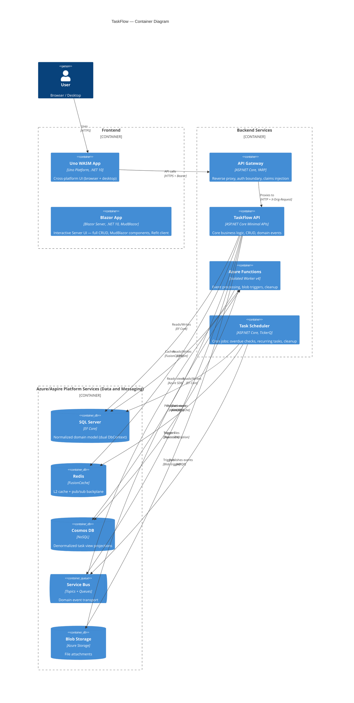

> **Diagram legend:** All relationships shown as solid arrows with protocol labels. Blue containers = compute services, orange containers = data/messaging platform services, purple containers = frontend UI. Solid arrows = read/write. Dashed arrows = secondary r/w. Dotted arrows = async trigger.

### 2.3 Component Diagram — TaskFlow API

Internal structure of the core API service.


> **Diagram legend:** Arrows indicate direct dependencies. Components inside the API boundary reference each other; external containers represent infrastructure backing services.

---

## 3. Software Architecture Layers

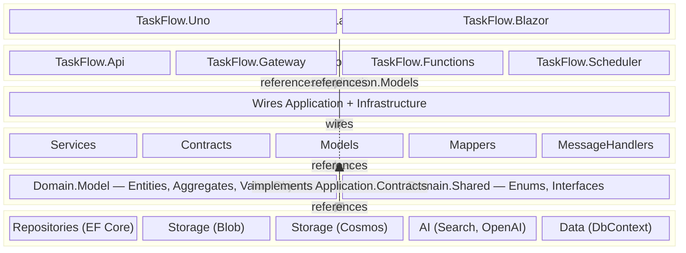

> **Legend:** Solid blue arrows = project references. Orange `implements` = Infrastructure implementing Application.Contracts interfaces. Dotted arrows = DI wiring (Bootstrapper wires layers at runtime, not a compile-time reference).

### Layer Responsibilities

| Layer | Projects | Responsibility | May Reference |
|-------|----------|---------------|---------------|
| **UI** | TaskFlow.Uno, TaskFlow.Blazor | User interfaces — Uno MVUX + Kiota; Blazor MudBlazor + Refit | Application.Models (shared contract) |
| **Host** | Api, Gateway, Functions, Scheduler | HTTP pipeline, function triggers, config | Bootstrapper |
| **Bootstrapper** | TaskFlow.Bootstrapper | DI composition root — wires all layers (not a layer itself; referenced by Hosts and Tests) | Application, Infrastructure |
| **Application** | Services, Contracts, Models, Mappers, MessageHandlers | Use-case services, validation, DTO mapping, tenant enforcement, integration event definitions | Domain |
| **Domain** | Domain.Model, Domain.Shared | Entities, aggregates, value objects, enums, marker interfaces | Nothing (no outward deps) |
| **Infrastructure** | Repositories, Data, Storage, AI | EF Core, Azure SDK implementations of Application.Contracts interfaces | Application.Contracts, Domain |

### Dependency Rules (Architecture-Test Enforced)

- **Domain** has zero references to Application, Infrastructure, or Host layers
- **Application.Services** has zero references to Infrastructure or Host layers
- **Infrastructure** implements `Application.Contracts` interfaces (not Domain contracts)
- All tenant entities implement `ITenantEntity<Guid>`
- All services have corresponding interfaces in Contracts
- Entity properties use private setters (encapsulation)

---

## 4. Service Topology

A clean representation of the Aspire-orchestrated service graph (equivalent to the Aspire dashboard graph view):

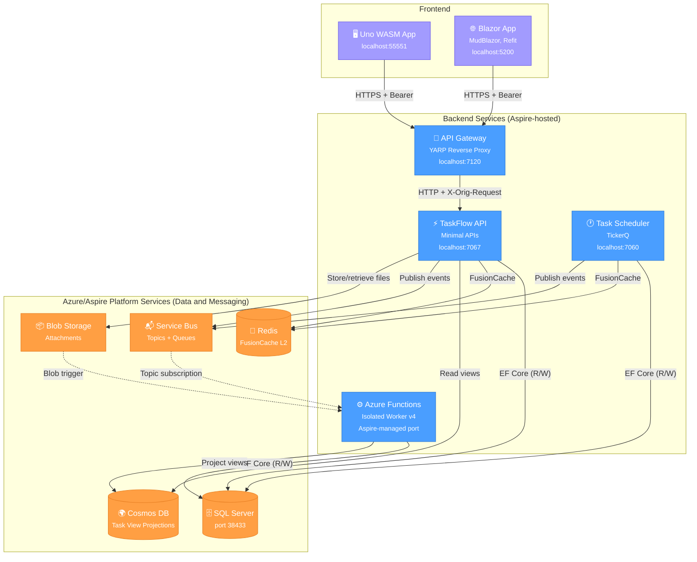

> **Legend:** Solid arrows = direct synchronous dependency ("read/write"). Dotted arrows = asynchronous/event-driven trigger (the service doesn't call directly; infrastructure triggers it via subscription or blob event). Dashed arrows = secondary read/write.

### Hosted Services

| Service | Project | Purpose | Key Dependencies |
|---------|---------|---------|-----------------|
| **API Gateway** | `TaskFlow.Gateway` | Auth boundary, YARP reverse proxy, claims injection | API |
| **TaskFlow API** | `TaskFlow.Api` | Core business logic, CRUD, integration events | SQL, Redis, Cosmos, Service Bus, Blob |
| **Azure Functions** | `TaskFlow.Functions` | Async event processing, blob processing, timer cleanup | SQL, Cosmos, Service Bus, Blob |
| **Task Scheduler** | `TaskFlow.Scheduler` | Cron jobs via TickerQ (overdue checks, recurring tasks, cleanup) | SQL, Redis, Service Bus |
| **Uno WASM App** | `TaskFlow.Uno` | Cross-platform UI (browser + desktop + mobile) — Uno Platform MVUX | Gateway |
| **Blazor App** | `TaskFlow.Blazor` | Interactive Server UI — MudBlazor, Refit client, full CRUD | Gateway, Application.Models, Domain.Shared |

---

## 5. Domain Model

### 5.1 Entity Relationship Diagram

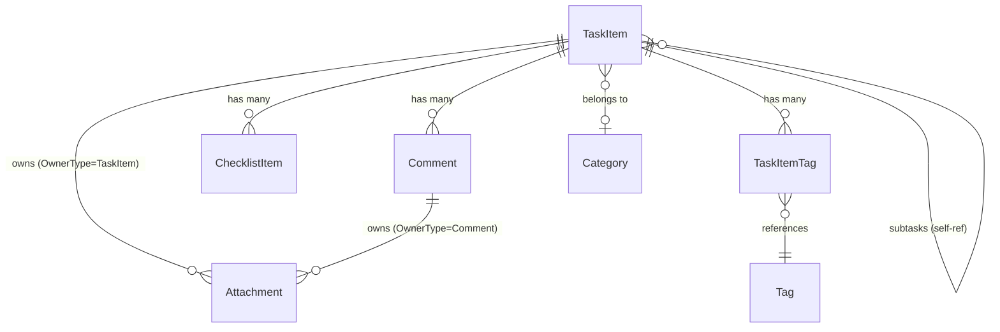

**Polymorphic Attachment ownership:** `Attachment` uses a discriminator pattern (`OwnerType` enum + `OwnerId` GUID) instead of separate foreign keys. `OwnerType` is either `TaskItem` or `Comment`, and `OwnerId` points to the owning entity's `Id`. This avoids multiple nullable FKs and allows any entity type to own attachments.


### 5.2 Base Entity

All entities inherit from `EntityBase` (NuGet: `EF.Domain`) which provides:

| Property | Type | Purpose |
|----------|------|---------|
| `Id` | `Guid` | Primary key |
| `RowVersion` | `byte[]` | Optimistic concurrency token |

> **Note:** `EntityBase` does **not** define audit properties (`CreatedAt`, `CreatedBy`, `UpdatedAt`, `UpdatedBy`). Soft-delete (`IsDeleted`) is defined on individual domain entities that support it, not on `EntityBase`. All audit/timestamp tracking is handled by the `AuditInterceptor` — see [Section 11: Audit Strategy](#11-audit-strategy).

All tenant entities also implement `ITenantEntity<Guid>` — enforcing `TenantId` on every row.

### 5.3 Value Objects

| Value Object | Properties | Used By |
|-------------|-----------|---------|
| **DateRange** | `StartDate`, `DueDate` (both `DateTimeOffset?`) | `TaskItem` |
| **RecurrencePattern** | Recurrence interval, frequency, end conditions | `TaskItem` (EF owned type) |

### 5.4 Integration Events

Events are defined in `Application.Contracts.Events` (not Domain layer). Published via `IIntegrationEventPublisher` to Service Bus.

| Event | Trigger | Downstream Effect |
|-------|---------|-------------------|
| `TaskItemCreatedEvent` | New task created | Service Bus → Functions → Cosmos projection |
| `TaskItemStatusChangedEvent` | Status transition | Service Bus → Functions → Cosmos projection |
| `TaskItemCompletedEvent` | Status → Completed | Notifications (future) |
| `TaskItemRescheduledEvent` | Date range updated | Recalculation (future) |
| `TaskItemOverdueSuspectedEvent` | Scheduler detects overdue | Escalation (future) |
| `CommentAddedEvent` | New comment on task | Notifications (future) |
| `AttachmentUploadedEvent` | File uploaded | Metadata extraction via Functions |

---

## 6. Data Flow Diagrams

### 6.1 Request Flow — CRUD Operation

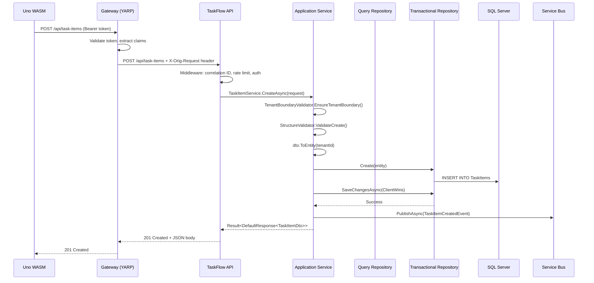

### 6.2 Event Processing Flow — Cosmos Projection

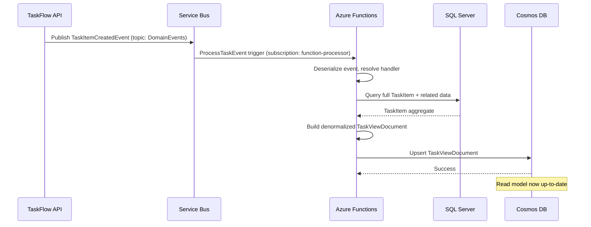

### 6.3 Attachment Upload Flow

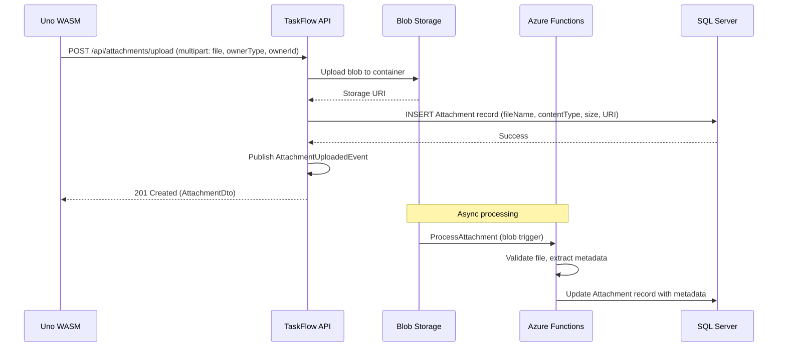

### 6.4 Caching Flow — FusionCache L1/L2

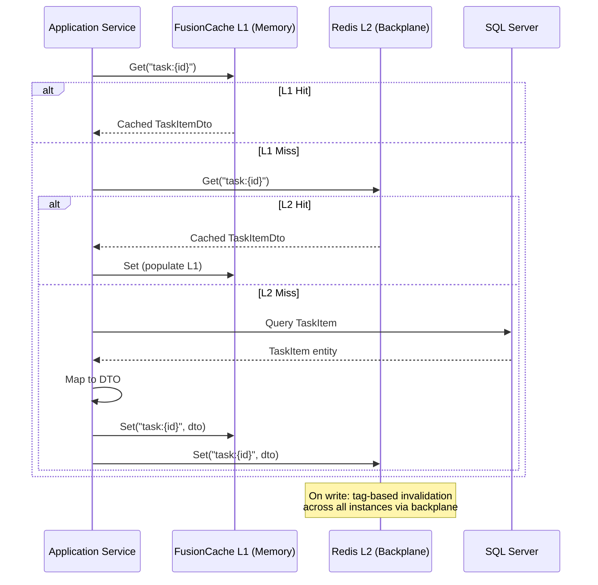

---

## 7. API Contract Summary

### 7.1 Entity Endpoints (Consistent CRUD Pattern)

| Method | Route | Purpose |
|--------|-------|---------|
| `POST` | `/api/{entity}/search` | Paged search with filters and sorting |
| `GET` | `/api/{entity}/{id}` | Get single entity by ID |
| `POST` | `/api/{entity}` | Create new entity |
| `PUT` | `/api/{entity}/{id}` | Update existing entity |
| `DELETE` | `/api/{entity}/{id}` | Delete entity |

**Entities with full CRUD**: `task-items`, `categories`, `tags`, `comments`, `checklist-items`, `attachments`  
**Entities with partial CRUD**: `task-item-tags` (create, get, delete — no search/update)

### 7.2 Special Endpoints

| Method | Route | Purpose |
|--------|-------|---------|
| `POST` | `/api/attachments/upload` | Multipart file upload (file, ownerType, ownerId) |
| `GET` | `/api/search/tasks` | AI-powered hybrid search (`?query=...&mode=hybrid&maxResults=10`) |
| `POST` | `/api/agent/chat` | AI agent chat endpoint |
| `GET` | `/api/task-views` | Cosmos DB denormalized views (`?tenantId=...&pageSize=20`) |
| `GET` | `/api/task-views/{id}` | Single task view (`?tenantId=...`) |
| `GET` | `/health` | Health check |
| `GET` | `/alive` | Liveness probe |

### 7.3 Request/Response Envelopes

```
DefaultRequest<TDto>         → Wraps a DTO for create/update operations
DefaultResponse<TDto>        → Single entity response with metadata
SearchRequest<TFilter>       → Paged search: Page, PageSize, SortBy, SortDirection, Filter
PagedResponse<TDto>          → Items[] + TotalCount + pagination metadata
Result<T>                    → Success | Failure(errors) | None (404)
```

### 7.4 Middleware Pipeline (Order of Execution)

```
1. SecurityHeadersMiddleware       — Adds security response headers
2. CorrelationIdMiddleware         — Generates/propagates X-Correlation-Id
3. ExceptionHandler                — Catches exceptions → ProblemDetails (409, 422, 404, 403, 500)
4. RateLimiter                     — Per-tenant, 100 requests/minute
5. CORS                            — Policy "TaskFlowUi" for allowed origins
6. Authentication                  — Scaffold (dev) or JWT Bearer (Entra ID)
7. Authorization                   — Policy-based (see Security Model)
8. GatewayClaimsMiddleware         — Extracts X-Orig-Request header from Gateway
9. OpenAPI / Scalar UI             — API documentation (if enabled)
10. Health + Alive endpoints       — /health, /alive
11. Entity Endpoints               — All CRUD endpoint groups
```

---

## 8. Security Model

### 8.1 Authentication Modes

| Mode | Environment | Mechanism |
|------|-------------|-----------|
| **Scaffold** | Development | Predictable test identity; all requests succeed; no real token validation |
| **Entra ID** | Production | JWT Bearer validation against Microsoft Entra External ID tenant |

The mode is config-driven (`Auth:Mode` in `appsettings.json`), allowing a single build to serve both environments.

### 8.2 Multi-Tenancy Enforcement

Tenant isolation is enforced at **three levels**:

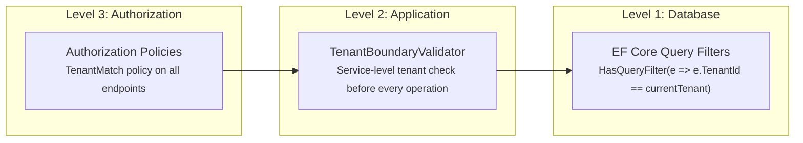

- **Query Filters**: Every `ITenantEntity<Guid>` has an automatic EF Core query filter scoped to the current tenant. Cross-tenant data is invisible at the SQL level.
- **Service Validation**: `TenantBoundaryValidator` checks every service call to prevent tenant leakage, even for operations that bypass query filters.
- **Authorization Policies**: Middleware-level enforcement before requests reach services.

### 8.3 Authorization Policies

| Policy | Purpose |
|--------|---------|
| `GlobalAdmin` | System-wide admin operations |
| `TenantMatch` | Request tenant must match authenticated user's tenant |
| `TenantAdmin` | Admin within a specific tenant |
| `StatusTransition` | Controls who can transition task statuses |

### 8.4 Gateway Claims Flow

```
User → Gateway: Bearer {user-token}
Gateway: Validate token (Entra or scaffold)
Gateway: Acquire service-to-service token
Gateway → API: Authorization: Bearer {service-token}
              + X-Orig-Request: Base64({ oid, tenant_id, name, roles })
API: GatewayClaimsMiddleware extracts X-Orig-Request
API: Sets IRequestContext (tenant, user, roles)
```

### 8.5 Rate Limiting

Per-tenant fixed window: **100 requests per minute**. Returns `429 Too Many Requests` with `Retry-After` header.

---

## 9. Deployment Topology

### 9.1 Local Development (Aspire)

All infrastructure runs as persistent emulators — no Azure subscription required.

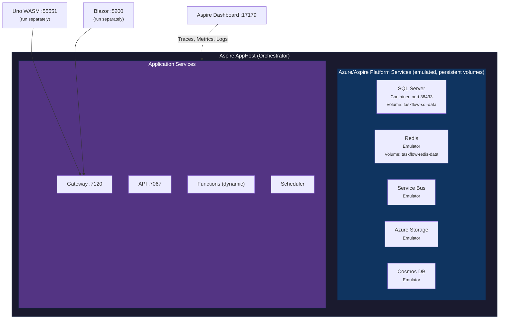

**Start locally**:
```bash
dotnet run --project src/Aspire/AppHost
# Uno WASM runs separately (Uno.Sdk constraint)
```

**Service dependencies**: API waits for SQL + Redis. Gateway waits for API. Functions wait for SQL + Storage.

### 9.2 Cloud Deployment (Azure)

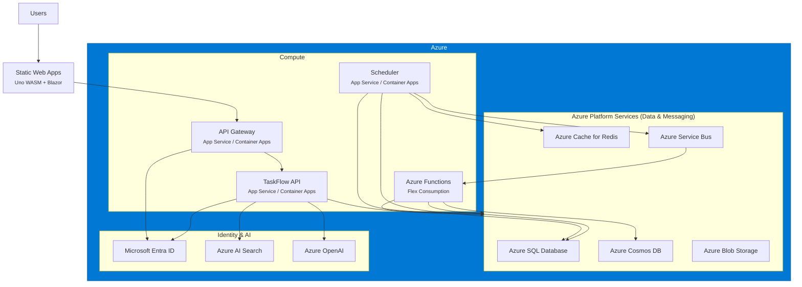

---

## 10. Observability

### 10.1 OpenTelemetry

Configured via **Aspire Service Defaults** (`Extensions.cs`):

| Signal | Instrumentation |
|--------|----------------|
| **Traces** | ASP.NET Core, HttpClient, custom spans |
| **Metrics** | ASP.NET Core, HttpClient, .NET Runtime, FusionCache |
| **Logs** | Structured logging with `IncludeFormattedMessage` + scopes |
| **Exporter** | OTLP (to Aspire Dashboard locally, Azure Monitor in cloud) |

### 10.2 Health Checks

| Endpoint | Source | Purpose | Checks |
|----------|--------|---------|--------|
| `/healthz` | ServiceDefaults | Liveness | All registered checks |
| `/readyz` | ServiceDefaults | Readiness | Checks tagged `"ready"` (SQL, Redis) |
| `/health` | API | Custom health check | SQL connectivity |
| `/alive` | API | Simple liveness | Always returns 200 |

### 10.3 Correlation Tracking

- `CorrelationIdMiddleware` generates or propagates `X-Correlation-Id` on every request
- Correlation ID flows through: HTTP headers → service calls → integration events → Function triggers → logs
- Enables end-to-end distributed tracing across all services

### 10.4 Aspire Dashboard

Locally at `http://localhost:17179`:
- Resource graph (all services + infra)
- Structured logs with filtering
- Distributed traces (request → service → database)
- Metrics (throughput, latency, errors)

---

## 11. Audit Strategy

### 11.1 Overview

TaskFlow uses an **EF Core SaveChanges interceptor** pattern for entity-level auditing. The `AuditInterceptor<string, Guid?>` (from NuGet package `EF.Data.Interceptors`) intercepts the transactional DbContext and publishes audit records via the internal message bus.

> **Important:** `EntityBase` does **not** define audit properties (`CreatedAt`, `CreatedBy`, `UpdatedAt`, `UpdatedBy`). All audit persistence flows through the interceptor → message bus → repository pipeline described below.

### 11.2 Audit Flow


> The `IInternalMessageBus` uses a `System.Threading.Channels` background task. The interceptor enqueues the audit message and **returns immediately**, so `SaveChangesAsync()` is not blocked by audit persistence.

### 11.3 AuditLogTableEntity Schema

| Field | Type | Description |
|-------|------|-------------|
| `Id` | `string` | Unique audit record ID |
| `AuditId` | `string` | Correlation ID grouping related changes |
| `TenantId` | `string` | Tenant identifier |
| `EntityType` | `string` | CLR type name of the audited entity |
| `EntityKey` | `string` | Primary key of the audited entity |
| `Action` | `string` | `Insert`, `Update`, or `Delete` |
| `Status` | `string` | Outcome status |
| `StartTimeTicks` | `long` | Operation start (ticks) |
| `ElapsedTimeTicks` | `long` | Duration (ticks) |
| `RecordedUtc` | `DateTimeOffset` | When the audit was recorded |
| `Metadata` | `string` | Serialized property changes / extra context |
| `Error` | `string` | Error details (if failed) |

**Partition/Row key strategy:** `PartitionKey` = tenant ID (or `"_system"` for non-tenant operations); `RowKey` = reverse-ticks for newest-first queries.

### 11.4 Fallback

When Azure Table Storage is unavailable (e.g., local dev without emulator), the DI container registers `NoOpAuditLogRepository`, which silently discards audit entries.

### 11.5 Key Source Files

| File | Purpose |
|------|---------|
| `TaskFlow.Bootstrapper/Registration/RegisterServices.Database.cs` | Registers `AuditInterceptor` on Trxn DbContext |
| `TaskFlow.Application.MessageHandlers/AuditHandler.cs` | Handles audit messages from internal bus |
| `TaskFlow.Application.Contracts/Storage/IAuditLogRepository.cs` | Repository contract |
| `TaskFlow.Infrastructure.Storage/AuditLogRepository.cs` | Azure Table Storage implementation |
| `TaskFlow.Infrastructure.Storage/AuditLogTableEntity.cs` | Table entity mapping |
| `TaskFlow.Infrastructure.Storage/NoOpAuditLogRepository.cs` | No-op fallback |

---

## 12. Testing Strategy

### 12.1 Test Pyramid

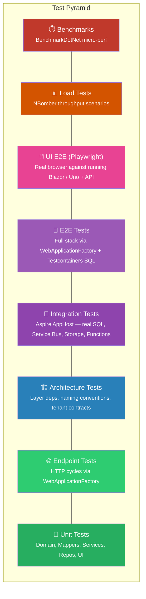

### 12.2 Test Projects

| Project | Purpose | Value | Primary Tools |
|---------|---------|-------|---------------|
| **Test.Unit** | Pure-CPU verification of domain logic, DTO ↔ entity mapping, application service success/failure/conflict paths, in-memory repository CRUD, and Uno API-service mappers. | Fastest feedback loop — millisecond runs, zero infrastructure. Catches regressions in pure logic before slower suites are touched. | MSTest, **Moq**, EF Core InMemory provider |
| **Test.Endpoints** | Drives every HTTP endpoint through the full ASP.NET Core pipeline (middleware → endpoint → service → repo) and asserts status codes (200/201/400/404/409/422), envelopes, and ProblemDetails shapes. | Confirms wire contract without paying for real infrastructure. The whole API surface boots in under a second and runs against an isolated EF InMemory database per factory instance. | MSTest, `Microsoft.AspNetCore.Mvc.Testing` (**WebApplicationFactory**), EF Core InMemory |
| **Test.Architecture** | Asserts compile-time layering and naming rules: Domain has zero outward references; `Application.Services` cannot reference Infrastructure or Hosts; every tenant entity implements `ITenantEntity<Guid>`; services have matching `I*` interfaces; entity setters are private. | Architectural drift is caught by CI rather than by a future code review. Rules are expressed in fluent C#, run with `dotnet test`, and travel with the code instead of living in a wiki. | MSTest, **NetArchTest.Rules** |
| **Test.Integration** | End-to-end verification of cross-service workflows by booting the full **Aspire AppHost** in-process: SQL Server, Service Bus emulator, Azure Table Storage, and (when `func.exe` is on PATH) Azure Functions. Covers EF migrations, repository CRUD with paging, the audit pipeline (interceptor → channel → table storage), and domain-event flow (API publish → Service Bus → Function projection → audit row). | Highest-fidelity tests that still run on a developer laptop. Because Aspire wires the same resources used by `dotnet run`, behavior matches the local dev experience and the cloud deployment. | MSTest, **Aspire.Hosting.Testing** (`DistributedApplicationTestingBuilder`), Testcontainers.MsSql, `Azure.Data.Tables` |
| **Test.E2E** | Multi-endpoint workflow tests (create → search → update → delete) against a real SQL Server container — cases where the InMemory provider's missing semantics (FK constraints, projection plans, concurrency tokens) would hide bugs. | Bridges Test.Endpoints (fast, in-memory) and Test.Integration (full AppHost). Trades the InMemory shortcut for real RDBMS semantics without paying for the rest of the Aspire graph. | MSTest, WebApplicationFactory, **Testcontainers.MsSql** |
| **Test.Load** | NBomber HTTP scenarios — task-search throughput and CRUD generation — with assertions on success rate (≥ 95 %) and P99 latency (< 2 s). | Catches pre-prod throughput regressions and gives a reproducible perf baseline. Tests are `[Ignore]`'d by default (manual run) so they never gate CI on infra availability. | MSTest, **NBomber**, NBomber.Http |
| **Test.Benchmarks** | BenchmarkDotNet console runner exercising hot-path mappers (`ToDto`, `ToEntity`) with `[MemoryDiagnoser]` for allocation tracking. | Quantifies the cost of mapping changes — guards against silent allocation regressions when DTOs are extended. | **BenchmarkDotNet** |
| **Test.Support** | Reusable test infrastructure: `WebApplicationFactoryBase<TProgram, TTrxn, TQuery>`, fluent entity builders (`CategoryBuilder`, `TaskItemBuilder`, `CommentBuilder`, `TagBuilder`), shared constants. | Removes ~100 lines of duplicated DI-rewiring boilerplate from every WebApplicationFactory test project. Builders give tests intent-revealing fixture data. | `Microsoft.AspNetCore.Mvc.Testing`, EF Core InMemory |
| **Test.PlaywrightUI** | Browser-driven UI tests against the running Blazor (`https://localhost:7201`) and Uno WASM (`https://localhost:7069`) frontends — full CRUD lifecycle (create → edit → delete), dashboard smoke, regression scenarios. | The only suite that actually clicks the UI. Catches binding errors, MudBlazor / Uno render bugs, and broken navigation that all server-side tests miss. | **Playwright** (TypeScript, `@playwright/test`) |

### 12.3 Testing Tools

| Tool | Role | What It Provides |
|------|------|------------------|
| **MSTest** | Test runner (Microsoft) | `[TestClass] / [TestMethod] / [TestCategory]`, `Assert.*`, parallelization (`MSTestParallelize{Assembly,TestClasses}`), `[AssemblyInitialize]` / `[AssemblyCleanup]` for shared fixtures. |
| **Moq** | Mocking framework | Lambda-based fakes for service interfaces (`Mock<IFoo>`); used in `Test.Unit` to isolate services from repositories and external clients. |
| **NetArchTest.Rules** | Architecture assertion DSL | Fluent rules over reflected assemblies — `Types.InAssembly(asm).ShouldNot().HaveDependencyOnAny(...).GetResult()`. Failure surfaces the offending types. Run as ordinary MSTest cases. |
| **BenchmarkDotNet** | Micro-benchmark harness | Warmup / iteration control, statistical noise rejection, `[MemoryDiagnoser]` for GC allocations, console summary tables. Run as `dotnet run -c Release --project src/Test/Test.Benchmarks`. |
| **NBomber + NBomber.Http** | Load-test framework | `Scenario.Create(...)`, `Simulation.Inject(rate, interval, during)` for arrival-rate load, percentile assertions on latency / success. HTTP helpers for request building. |
| **`Microsoft.AspNetCore.Mvc.Testing`** | In-process API host (**WebApplicationFactory**) | Boots `Program.cs` against a `TestServer` — full DI, middleware, routing, model binding — without Kestrel. Returns an `HttpClient` and exposes the `IServiceCollection` for test-time service replacement. |
| **Testcontainers** (`Testcontainers.MsSql`) | Ephemeral Docker containers | Spawns SQL Server 2025 in a throwaway container per fixture; tests use the real engine with no manual install. Disposes the container automatically. |
| **Aspire.Hosting.Testing** | AppHost in-process orchestration | `DistributedApplicationTestingBuilder.CreateAsync(typeof(AppHostProgram))` boots the whole resource graph (SQL, Service Bus, Storage, Functions) in one call. `app.GetConnectionStringAsync(...)` and `app.CreateHttpClient(...)` return wired clients. |
| **Playwright** (`@playwright/test`) | Cross-browser automation | Headless Chrome/Firefox/WebKit, auto-waiting locators, `screenshot: "only-on-failure"`, `trace: "on-first-retry"`. Driven from a TypeScript `playwright.config.ts`. |

### 12.4 Test.Support — `WebApplicationFactoryBase`

`Test.Support` centralizes the WebApplicationFactory plumbing that would otherwise be re-implemented in every HTTP test project. The base class is generic over the host program and both DbContexts:

```csharp
public abstract class WebApplicationFactoryBase<TProgram, TTrxnContext, TQueryContext>
    : WebApplicationFactory<TProgram>
    where TProgram : class
    where TTrxnContext : DbContextBase<string, Guid?>
    where TQueryContext : DbContextBase<string, Guid?>
{
    protected override void ConfigureWebHost(IWebHostBuilder builder)
    {
        builder.UseEnvironment("Development");
        builder.ConfigureServices(services =>
        {
            services.RemoveAll<IHostedService>();
            RemoveStandardEfInfrastructure(services);   // pooled context, audit + nolock interceptors,
                                                        // scoped factory, IDbContextFactory
            RemoveAppSpecificServices(services);        // overridable hook
            var trxnOptions  = BuildTrxnOptions();      // abstract — subclass picks the DB
            var queryOptions = BuildQueryOptions();
            services.AddScoped(_ => CreateContext<TTrxnContext>(trxnOptions));
            services.AddScoped(_ => CreateContext<TQueryContext>(queryOptions));
            services.AddSingleton<IDbContextFactory<TTrxnContext>>(new TestDbContextFactory<TTrxnContext>(trxnOptions));
            services.AddSingleton<IDbContextFactory<TQueryContext>>(new TestDbContextFactory<TQueryContext>(queryOptions));
        });
    }
    protected abstract DbContextOptions BuildTrxnOptions();
    protected abstract DbContextOptions BuildQueryOptions();
}
```

| Concern | How it's handled |
|---------|------------------|
| **Hosted services** | All `IHostedService` registrations stripped — tests never start TickerQ jobs, Service Bus listeners, or background workers by accident. |
| **Pooled DbContext** | Removed via `RemoveDescriptorsByImplPartialName("DbContextPool")` so test contexts get the lifetime the test wants. |
| **Audit + ConnectionNoLock interceptors** | Removed — audit is asserted in dedicated integration tests, not on every endpoint cycle. |
| **DbContext construction** | `TestDbContextFactory<T>` builds contexts via reflection, side-stepping `required` members on `DbContextBase`. |
| **DB choice** | Subclass overrides `BuildTrxnOptions()` / `BuildQueryOptions()` — `UseInMemoryDatabase(...)` for endpoint contract tests, `UseSqlServer(connString)` for E2E. |

Concrete subclasses are tiny:

```csharp
// Test.Endpoints — fast, in-memory
public sealed class CustomApiFactory
    : WebApplicationFactoryBase<Program, TaskFlowDbContextTrxn, TaskFlowDbContextQuery>
{
    private readonly string _dbName = $"TestDb_{Guid.NewGuid()}";
    protected override DbContextOptions BuildTrxnOptions()  =>
        new DbContextOptionsBuilder<TaskFlowDbContextTrxn>().UseInMemoryDatabase(_dbName).Options;
    protected override DbContextOptions BuildQueryOptions() =>
        new DbContextOptionsBuilder<TaskFlowDbContextQuery>().UseInMemoryDatabase(_dbName).Options;
}

// Test.E2E — real SQL via Testcontainers
public sealed class SqlApiFactory
    : WebApplicationFactoryBase<Program, TaskFlowDbContextTrxn, TaskFlowDbContextQuery>
{
    public static async Task StartContainerAsync() { /* MsSqlBuilder(...).StartAsync() once per assembly */ }
    protected override DbContextOptions BuildTrxnOptions()  =>
        new DbContextOptionsBuilder<TaskFlowDbContextTrxn>().UseSqlServer(_connectionString).Options;
    protected override DbContextOptions BuildQueryOptions() =>
        new DbContextOptionsBuilder<TaskFlowDbContextQuery>().UseSqlServer(_connectionString).Options;
}
```

**Why a base class:** every HTTP test project (Endpoints, E2E) needs the same surgical DI rewiring. Centralising it means a fix for an interceptor or pooled-context bug applies to all suites at once — and new test projects only need to choose a database backend.

#### `WebApplicationFactory` itself

`Microsoft.AspNetCore.Mvc.Testing.WebApplicationFactory<TProgram>` boots the application's `Program.cs` against an in-memory `TestServer`. The full ASP.NET Core pipeline runs (auth, middleware, routing, endpoint binding, exception handling, ProblemDetails) but no socket is opened — calls go through `factory.CreateClient()`, an `HttpClient` wired to the `TestServer`. The factory exposes `ConfigureWebHost(...)` so tests can replace services in the same DI container the host uses, which is how this codebase swaps SQL Server for InMemory or container-backed SQL.

### 12.5 Choosing the Right Host: WebApplicationFactory vs Testcontainers vs Aspire.Hosting.Testing

The three approaches are complementary, not competing — pick by the boundary you want to test:

| Aspect | WebApplicationFactory | Testcontainers | Aspire.Hosting.Testing |
|--------|----------------------|----------------|------------------------|
| **What it boots** | One ASP.NET Core app in-process | One Docker container per resource (SQL, Redis, etc.) | The whole `AppHost` graph in-process — every service + every backing resource Aspire knows about |
| **Networking** | None (TestServer) | Real TCP via Docker | Real TCP between Aspire-managed services |
| **Process model** | Single test process | Test process + N Docker containers | Test process + Aspire orchestrator + N containers / emulators |
| **Startup cost** | < 1 s | Seconds (container pull / start) | Tens of seconds (whole graph) |
| **DI override** | Trivial — same `IServiceCollection` | N/A (configure container, then connection-string into your code) | Limited — you get connection strings & HTTP clients; you don't reach inside other services |
| **Test isolation** | Per-factory instance | Per-fixture container | Shared via `[AssemblyInitialize]` (one Aspire app per test assembly) |
| **Used in this repo** | `Test.Endpoints`, `Test.E2E` (composed with Testcontainers) | `Test.E2E` (`SqlApiFactory`) | `Test.Integration` (`DatabaseFixture`) |

**When to reach for which:**

- **WebApplicationFactory** — endpoint contract tests, ProblemDetails shapes, auth / authz routing, anything where the API is the system under test and the database layer can be substituted.
- **Testcontainers** — workflows that depend on real RDBMS semantics (FK cascades, optimistic concurrency, EF projection plans) but only need *one* backing service.
- **Aspire.Hosting.Testing** — multi-service workflows: API publishes a domain event → Service Bus → Function consumes → Cosmos projection → Azure Table audit row appears. No other tool wires that graph for you with a one-liner.

`DistributedApplicationTestingBuilder.CreateAsync(typeof(AppHostProgram))` reflectively loads the AppHost's `Program` type and invokes its `Main` against a builder configured for testing. The resulting `DistributedApplication` exposes `GetConnectionStringAsync(name)` and `CreateHttpClient(serviceName)` to talk to any resource — including ones gated behind environment flags (e.g., `TASKFLOW_INCLUDE_FUNCTIONS=true` in `DatabaseFixture` to include the Functions host only when `func.exe` is present on the developer's PATH).

### 12.6 Test.PlaywrightUI

A standalone TypeScript Playwright project that drives the **running** UI and API in a real browser. It is *not* `dotnet test`-orchestrated — it lives outside the .NET solution and runs via `npm`.

**Project layout**

```
Test.PlaywrightUI/
├── package.json              # @playwright/test ^1.59.1
├── playwright.config.ts      # Two projects: 'blazor' and 'uno'
├── tests/
│   ├── blazor/task-crud.spec.ts
│   └── uno/
│       ├── task-crud.spec.ts
│       ├── taskflow-task-list-regression.spec.ts
│       └── taskflow-ui.spec.ts
└── utils/
    ├── blazorTestUtils.ts    # MudBlazor-aware helpers (.mud-table, .mud-dialog, ...)
    └── unoTestUtils.ts
```

**Two browser projects**, configured in `playwright.config.ts`:

| Project | `baseURL` | Tests against |
|---------|-----------|---------------|
| `blazor` | `https://localhost:7201` | Blazor MudBlazor app |
| `uno` | `https://localhost:7069` | Uno Platform WASM app |

Both projects use Desktop Chrome, ignore HTTPS errors (self-signed dev cert), capture screenshots on failure, and record traces on first retry. `workers: 1` and `mode: "serial"` in spec files keep state-dependent CRUD steps in order.

**Prerequisites — Playwright drives a real browser, so the full vertical slice must be running before you run the suite:**

1. **API** — `dotnet run --project src/Host/Aspire/AppHost` boots SQL, Service Bus, Storage, the API, the Gateway, and seed data.
2. **UI** — depending on the project being tested:
   - Blazor at `https://localhost:7201` (`dotnet run --project src/UI/TaskFlow.Blazor`)
   - Uno WASM at `https://localhost:7069` (run separately — Uno SDK constraint)
3. **Browsers** — `npx playwright install --with-deps chromium` (one-time).

**Running**

```bash
cd src/Test/Test.PlaywrightUI
npm install
npm run test:blazor          # Blazor project only
npm run test:uno             # Uno project only
npm run test                 # Both
npm run test:full:fast       # No retries, max 4 failures, 120 s timeout — for local triage
```

**How a test reads.** `blazorTestUtils.ts` encodes MudBlazor's selectors so specs stay readable:

```typescript
await waitForApp(page);                              // GET /tasks, wait for heading
await navigateToNewTask(page);                       // click "New Task" → wait for editor
await fillTextField(page, "Title", uniqueTitle("E2E-Create"));
await selectOption(page, "Status", "In Progress");   // MudSelect popover dance
await clickSave(page);
await expectSnackbar(page, "saved");                 // .mud-snackbar
await expectTaskInTable(page, taskTitle);            // .mud-table-body
```

**What this catches.** Server-side suites cannot observe binding errors, missing `@onclick` wiring, broken MudDialog renders, Uno XAML resource errors, or the dialog-confirm-then-API-call sequence. Playwright drives the entire stack the user touches — UI, Gateway, API, database — so any broken link in that chain surfaces as a failed step with a screenshot and trace.

### 12.7 Running Tests

```bash
# Unit + architecture (fast, no infrastructure)
dotnet test --filter "TestCategory=Unit|TestCategory=Architecture"

# Endpoint contract tests (in-memory DB, no Docker)
dotnet test src/Test/Test.Endpoints

# E2E tests (Docker required — Testcontainers SQL)
dotnet test src/Test/Test.E2E

# Integration tests (boots Aspire AppHost — Docker + emulators)
dotnet test --filter "TestCategory=Integration"

# Load tests (manual — needs API host running on localhost:5000)
dotnet test --filter "TestCategory=Load"

# Benchmarks (Release build, console runner)
dotnet run -c Release --project src/Test/Test.Benchmarks

# UI E2E (requires Blazor and/or Uno running, plus API + seed data)
cd src/Test/Test.PlaywrightUI && npm run test
```

---

## 13. UI Architecture

### 13.1 Uno Platform WASM (Primary UI)

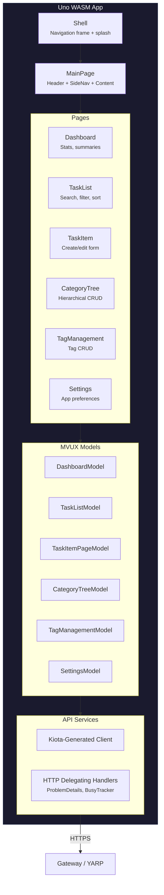

**Key patterns**:

| Pattern | Implementation |
|---------|---------------|
| **MVUX** | Uno's Model-View-Update-eXtended — reactive state management |
| **Kiota Client** | Auto-generated HTTP client from OpenAPI spec |
| **Mock Mode** | `Features:UseMocks=true` → canned 15-task dataset, no network calls |
| **Form Guard** | `IFormGuard` prevents navigation away from unsaved edits |
| **Navigation** | PanelVisibilityNavigator swaps sibling panels; detail pages push onto frame stack |

### 13.2 Blazor WASM/Server UI


`TaskFlow.Blazor` is a fully-built **.NET 10 Interactive Server** application using **MudBlazor** components and a **Refit** HTTP client (`ITaskFlowApiClient`) with `AddStandardResilienceHandler()`. It connects to the API through the YARP Gateway.

**Layout:** MudAppBar (hamburger toggle, "TaskFlow" title, breadcrumb via `FloatService.ModuleName`, progress spinner, dark mode toggle) + MudDrawer (nav: Dashboard, Tasks, Categories, Tags, Settings).

**Pages:**

| Route | Page | Purpose |
|-------|------|---------|
| `/` | Dashboard | Overview stats |
| `/tasks` | TaskList | Search, filter, sort tasks |
| `/tasks/new` | TaskItemPage | Create new task |
| `/tasks/{Id:guid}` | TaskItemPage | Edit task (checklist/comments CRUD, dirty-check) |
| `/categories` | CategoryTree | Hierarchical category CRUD |
| `/tags` | TagManagement | Tag CRUD |
| `/settings` | Settings | App preferences |
| `/Error` | Error | Error display |

**Key patterns:**

| Pattern | Implementation |
|---------|---------------|
| **Component Library** | MudBlazor — Material Design components |
| **HTTP Client** | Refit-generated typed client (`ITaskFlowApiClient`) |
| **Resilience** | `AddStandardResilienceHandler()` (Microsoft.Extensions.Http.Resilience) |
| **FloatService** | Centralized request tracking, snackbar error display, change notifications |
| **Dirty Check** | Form change tracking with navigation guard |

### 13.3 Gateway as BFF

The YARP Gateway acts as a **Backend-for-Frontend (BFF)**:
- Handles user authentication (Entra ID or scaffold)
- Acquires service-to-service tokens for downstream API calls
- Injects `X-Orig-Request` with user claims for the API
- CORS configured for UI origins

---

## Appendix: Azure Functions & Scheduler Details

### Azure Functions

| Function | Trigger | Binding | Purpose |
|----------|---------|---------|---------|
| `HealthCheck` | HTTP GET `/health` | Anonymous | Health probe |
| `TaskApiProxy` | HTTP GET `/tasks` | Function key | Read-only task query (placeholder) |
| `ProcessTaskEvent` | Service Bus Topic | `DomainEvents` topic, `function-processor` subscription | Projects task events to Cosmos DB read model |
| `ProcessAttachment` | Blob | Attachment container | Validates files, extracts metadata, updates Attachment record |
| `StaleTaskCleanup` | Timer | Config-driven cron | Deletes cancelled/stale tasks older than 90 days |

### Scheduler Jobs (TickerQ)

| Job | Schedule | Purpose |
|-----|----------|---------|
| `OverdueTaskCheck` | Every 6 hours | Finds overdue tasks → publishes `TaskItemOverdueSuspectedEvent` |
| `RecurringTaskGeneration` | Daily 2:00 AM UTC | Generates new task instances from recurring patterns |
| `StaleTaskCleanup` | Weekly Sunday 3:00 AM UTC | Archives/soft-deletes old cancelled tasks |

TickerQ uses an EF Core operational store (`TickerQDbContext`, schema `"ticker"`) for job persistence when `Scheduling:UsePersistence=true`.
