# TaskFlow — Technical Design Document

> **Audience**: Developers onboarding to the project  
> **Last updated**: April 2026

---

## Table of Contents

1. [Overview](#1-overview)
2. [C4 Architecture Diagrams](#2-c4-architecture-diagrams)
3. [Software Architecture Layers](#3-software-architecture-layers)
4. [Service Topology](#4-service-topology)
5. [Domain Model](#5-domain-model)
6. [Data Flow Diagrams](#6-data-flow-diagrams)
7. [API Contract Summary](#7-api-contract-summary)
8. [Security Model](#8-security-model)
9. [Deployment Topology](#9-deployment-topology)
10. [Observability](#10-observability)
11. [Testing Strategy](#11-testing-strategy)
12. [UI Architecture](#12-ui-architecture)

---

## 1. Overview

TaskFlow is a **multi-tenant task management reference application** built on .NET 10 and .NET Aspire. It demonstrates production-grade patterns for building cloud-native distributed systems with Azure backing services.

### Tech Stack

| Layer | Technology |
|-------|-----------|
| **Orchestration** | .NET Aspire (local dev + cloud deployment) |
| **API** | ASP.NET Core Minimal APIs |
| **Gateway** | YARP Reverse Proxy |
| **Background Jobs** | Azure Functions (isolated worker v4), TickerQ Scheduler |
| **UI** | Uno Platform WASM (MVUX), Blazor (planned) |
| **Database** | SQL Server (EF Core, dual DbContext) |
| **Cache** | Redis (FusionCache with L1/L2 + backplane) |
| **Messaging** | Azure Service Bus (topics + queues) |
| **Read Model** | Azure Cosmos DB (denormalized projections) |
| **File Storage** | Azure Blob Storage |
| **AI** | Azure AI Search + Azure OpenAI (stubs) |
| **Auth** | Microsoft Entra ID (External) / Scaffold mode |
| **Observability** | OpenTelemetry (OTLP), Aspire Dashboard |
| **Testing** | xUnit, Architecture tests, NBomber, BenchmarkDotNet |

### Design Principles

- **Domain-Driven Design** — Aggregates, value objects, domain events, bounded contexts
- **CQRS-like** — Separate read/write DbContexts; denormalized Cosmos read model alongside normalized SQL
- **Multi-Tenant First** — Tenant isolation at query filter, service, and authorization layers
- **Event-Driven** — Domain events flow through Service Bus to Azure Functions for async processing
- **Config-Driven Auth** — Single build, multiple deployment profiles (dev scaffold vs Entra ID prod)
- **Emulator-Ready** — All Azure services run as local emulators via Aspire; no cloud account needed for development

---

## 2. C4 Architecture Diagrams

### 2.1 Context Diagram

Shows the TaskFlow system boundary, its users, and external dependencies.

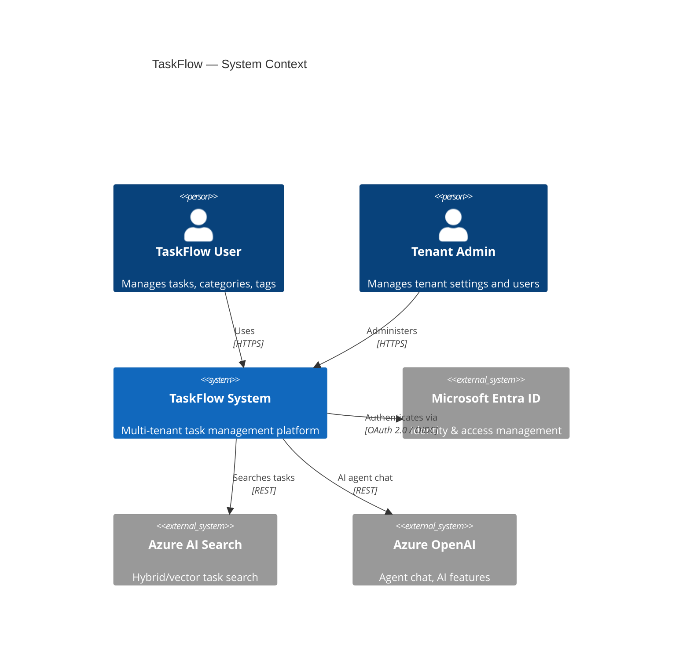

### 2.2 Container Diagram

All deployable units and infrastructure resources with their relationships.

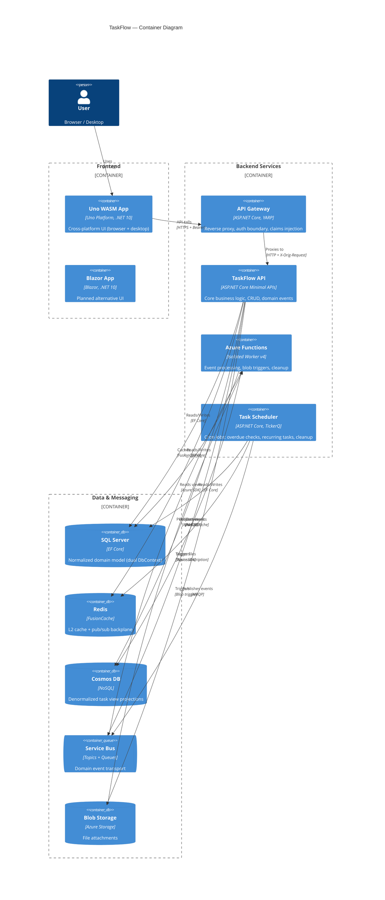

### 2.3 Component Diagram — TaskFlow API

Internal structure of the core API service.

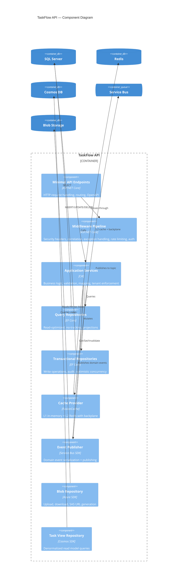

---

## 3. Software Architecture Layers

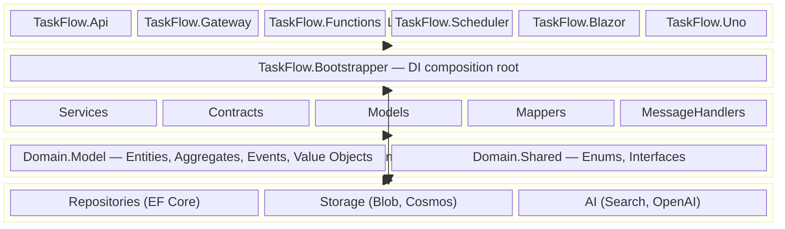

### Layer Responsibilities

| Layer | Projects | Responsibility | May Reference |
|-------|----------|---------------|---------------|
| **Host** | Api, Gateway, Functions, Scheduler, Blazor, Uno | HTTP pipeline, function triggers, UI shell, config | Bootstrapper |
| **Bootstrapper** | TaskFlow.Bootstrapper | DI composition root, wires all layers | Application, Infrastructure |
| **Application** | Services, Contracts, Models, Mappers, MessageHandlers | Business logic, validation, DTO mapping, tenant enforcement | Domain |
| **Domain** | Domain.Model, Domain.Shared | Entities, aggregates, value objects, domain events, enums | Nothing (no outward deps) |
| **Infrastructure** | Repositories, Storage, AI | EF Core, Azure SDK implementations of domain contracts | Domain |

### Dependency Rules (Architecture-Test Enforced)

- **Domain** has zero references to Application, Infrastructure, or Host layers
- **Application.Services** has zero references to Infrastructure or Host layers
- All entities implement `ITenantEntity<Guid>`
- All services have corresponding interfaces
- Entity properties use private setters (encapsulation)

---

## 4. Service Topology

A clean representation of the Aspire-orchestrated service graph:

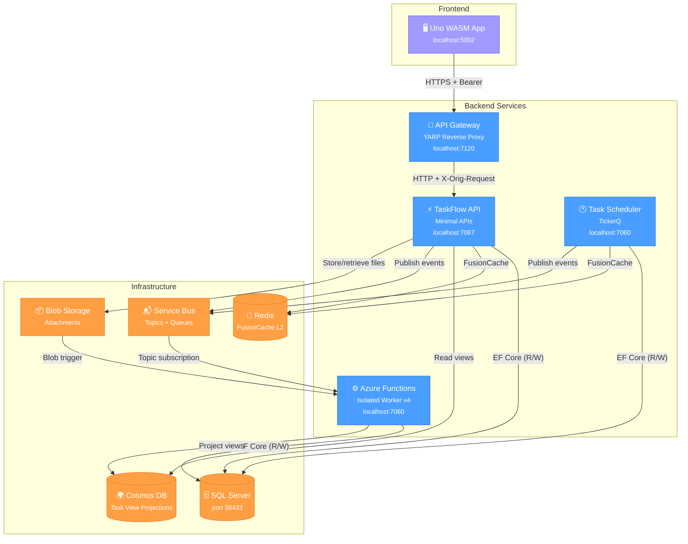

### Service Summary

| Service | Project | Purpose | Key Dependencies |
|---------|---------|---------|-----------------|
| **API Gateway** | `TaskFlow.Gateway` | Auth boundary, YARP reverse proxy, claims injection | API |
| **TaskFlow API** | `TaskFlow.Api` | Core business logic, CRUD, domain events | SQL, Redis, Cosmos, Service Bus, Blob |
| **Azure Functions** | `TaskFlow.Functions` | Async event processing, blob processing, timer cleanup | SQL, Cosmos, Service Bus, Blob |
| **Task Scheduler** | `TaskFlow.Scheduler` | Cron jobs via TickerQ (overdue checks, recurring tasks, cleanup) | SQL, Redis, Service Bus |
| **Uno WASM App** | `TaskFlow.Uno` | Cross-platform UI (browser + desktop) | Gateway |

---

## 5. Domain Model

### 5.1 Entity Relationship Diagram

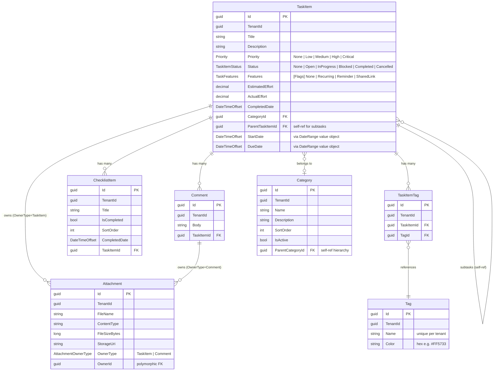

### 5.2 Base Entity

All entities inherit from `EntityBase` which provides:

| Property | Type | Purpose |
|----------|------|---------|
| `Id` | `Guid` | Primary key |
| `CreatedAt` | `DateTimeOffset` | Auto-set on creation |
| `UpdatedAt` | `DateTimeOffset` | Auto-set on mutation |
| `IsDeleted` | `bool` | Soft delete flag |

All entities also implement `ITenantEntity<Guid>` — enforcing `TenantId` on every row.

### 5.3 Value Objects

| Value Object | Properties | Used By |
|-------------|-----------|---------|
| **DateRange** | `StartDate`, `DueDate` (both `DateTimeOffset?`) | `TaskItem` |
| **RecurrencePattern** | Recurrence interval, frequency, end conditions | `TaskItem` (EF owned type) |

### 5.4 Domain Events

| Event | Trigger | Downstream Effect |
|-------|---------|-------------------|
| `TaskItemCreatedEvent` | New task created | Service Bus → Functions → Cosmos projection |
| `TaskItemStatusChangedEvent` | Status transition | Service Bus → Functions → Cosmos projection |
| `TaskItemCompletedEvent` | Status → Completed | Notifications (future) |
| `TaskItemRescheduledEvent` | Date range updated | Recalculation (future) |
| `TaskItemOverdueSuspectedEvent` | Scheduler detects overdue | Escalation (future) |
| `CommentAddedEvent` | New comment on task | Notifications (future) |
| `AttachmentUploadedEvent` | File uploaded | Metadata extraction via Functions |

---

## 6. Data Flow Diagrams

### 6.1 Request Flow — CRUD Operation

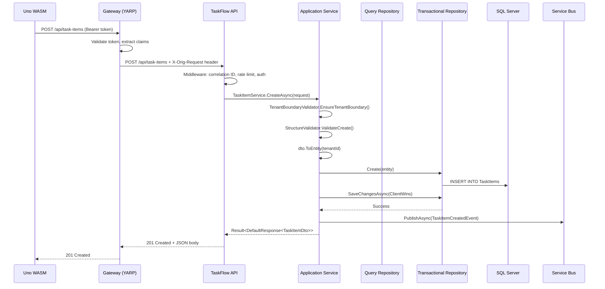

### 6.2 Event Processing Flow — Cosmos Projection

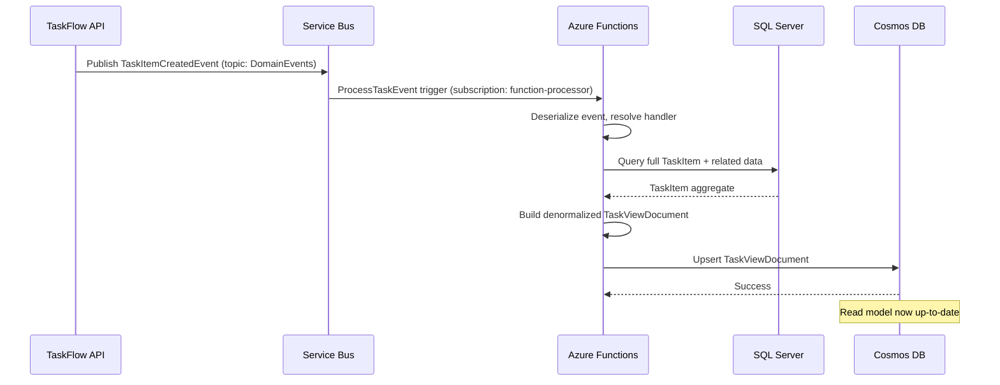

### 6.3 Attachment Upload Flow

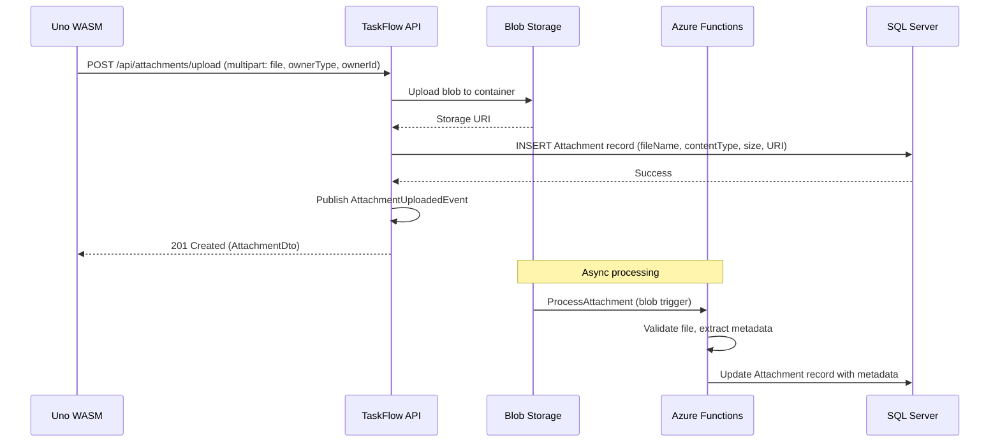

### 6.4 Caching Flow — FusionCache L1/L2

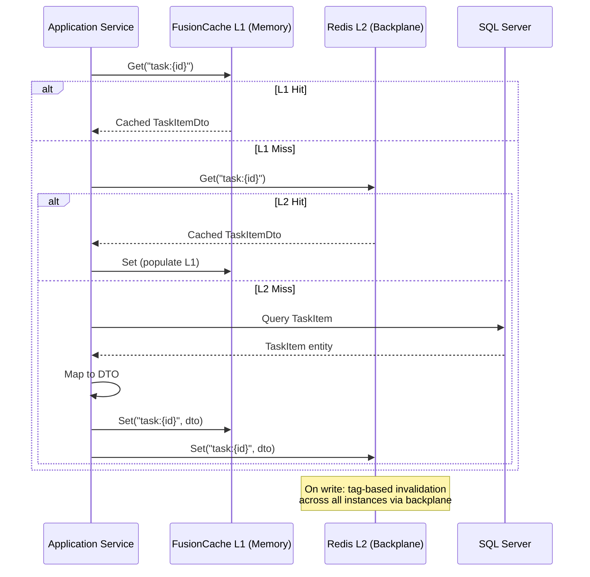

---

## 7. API Contract Summary

### 7.1 Endpoints

All entity endpoints follow a consistent CRUD pattern:

| Method | Route | Purpose |
|--------|-------|---------|
| `POST` | `/api/{entity}/search` | Paged search with filters and sorting |
| `GET` | `/api/{entity}/{id}` | Get single entity by ID |
| `POST` | `/api/{entity}` | Create new entity |
| `PUT` | `/api/{entity}/{id}` | Update existing entity |
| `DELETE` | `/api/{entity}/{id}` | Delete entity |

**Entities with full CRUD**: `task-items`, `categories`, `tags`, `comments`, `checklist-items`, `attachments`  
**Entities with partial CRUD**: `task-item-tags` (create, get, delete — no search/update)

**Special Endpoints**:

| Method | Route | Purpose |
|--------|-------|---------|
| `POST` | `/api/attachments/upload` | Multipart file upload (file, ownerType, ownerId) |
| `GET` | `/api/search/tasks` | AI-powered hybrid search (`?query=...&mode=hybrid&maxResults=10`) |
| `POST` | `/api/agent/chat` | AI agent chat endpoint |
| `GET` | `/api/task-views` | Cosmos DB denormalized views (`?tenantId=...&pageSize=20`) |
| `GET` | `/api/task-views/{id}` | Single task view (`?tenantId=...`) |
| `GET` | `/health` | Health check |
| `GET` | `/alive` | Liveness probe |

### 7.2 Request/Response Envelopes

```
DefaultRequest<TDto>         → Wraps a DTO for create/update operations
DefaultResponse<TDto>        → Single entity response with metadata
SearchRequest<TFilter>       → Paged search: Page, PageSize, SortBy, SortDirection, Filter
PagedResponse<TDto>          → Items[] + TotalCount + pagination metadata
Result<T>                    → Success | Failure(errors) | None (404)
```

### 7.3 Middleware Pipeline (Order of Execution)

```
1. SecurityHeadersMiddleware       — Adds security response headers
2. CorrelationIdMiddleware         — Generates/propagates X-Correlation-Id
3. ExceptionHandler                — Catches exceptions → ProblemDetails (409, 422, 404, 403, 500)
4. RateLimiter                     — Per-tenant, 100 requests/minute
5. CORS                            — Policy "TaskFlowUi" for allowed origins
6. Authentication                  — Scaffold (dev) or JWT Bearer (Entra ID)
7. Authorization                   — Policy-based (see Security Model)
8. GatewayClaimsMiddleware         — Extracts X-Orig-Request header from Gateway
9. OpenAPI / Scalar UI             — API documentation (if enabled)
10. Health + Alive endpoints       — /health, /alive
11. Entity Endpoints               — All CRUD endpoint groups
```

---

## 8. Security Model

### 8.1 Authentication Modes

| Mode | Environment | Mechanism |
|------|-------------|-----------|
| **Scaffold** | Development | Predictable test identity; all requests succeed; no real token validation |
| **Entra ID** | Production | JWT Bearer validation against Microsoft Entra External ID tenant |

The mode is config-driven (`Auth:Mode` in `appsettings.json`), allowing a single build to serve both environments.

### 8.2 Multi-Tenancy Enforcement

Tenant isolation is enforced at **three levels**:

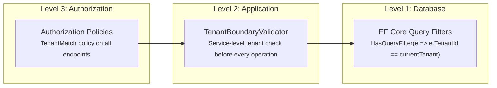

- **Query Filters**: Every `ITenantEntity<Guid>` has an automatic EF Core query filter scoped to the current tenant. Cross-tenant data is invisible at the SQL level.
- **Service Validation**: `TenantBoundaryValidator` checks every service call to prevent tenant leakage, even for operations that bypass query filters.
- **Authorization Policies**: Middleware-level enforcement before requests reach services.

### 8.3 Authorization Policies

| Policy | Purpose |
|--------|---------|
| `GlobalAdmin` | System-wide admin operations |
| `TenantMatch` | Request tenant must match authenticated user's tenant |
| `TenantAdmin` | Admin within a specific tenant |
| `StatusTransition` | Controls who can transition task statuses |

### 8.4 Gateway Claims Flow

```
User → Gateway: Bearer {user-token}
Gateway: Validate token (Entra or scaffold)
Gateway: Acquire service-to-service token
Gateway → API: Authorization: Bearer {service-token}
              + X-Orig-Request: Base64({ oid, tenant_id, name, roles })
API: GatewayClaimsMiddleware extracts X-Orig-Request
API: Sets IRequestContext (tenant, user, roles)
```

### 8.5 Rate Limiting

Per-tenant fixed window: **100 requests per minute**. Returns `429 Too Many Requests` with `Retry-After` header.

---

## 9. Deployment Topology

### 9.1 Local Development (Aspire)

All infrastructure runs as persistent emulators — no Azure subscription required.

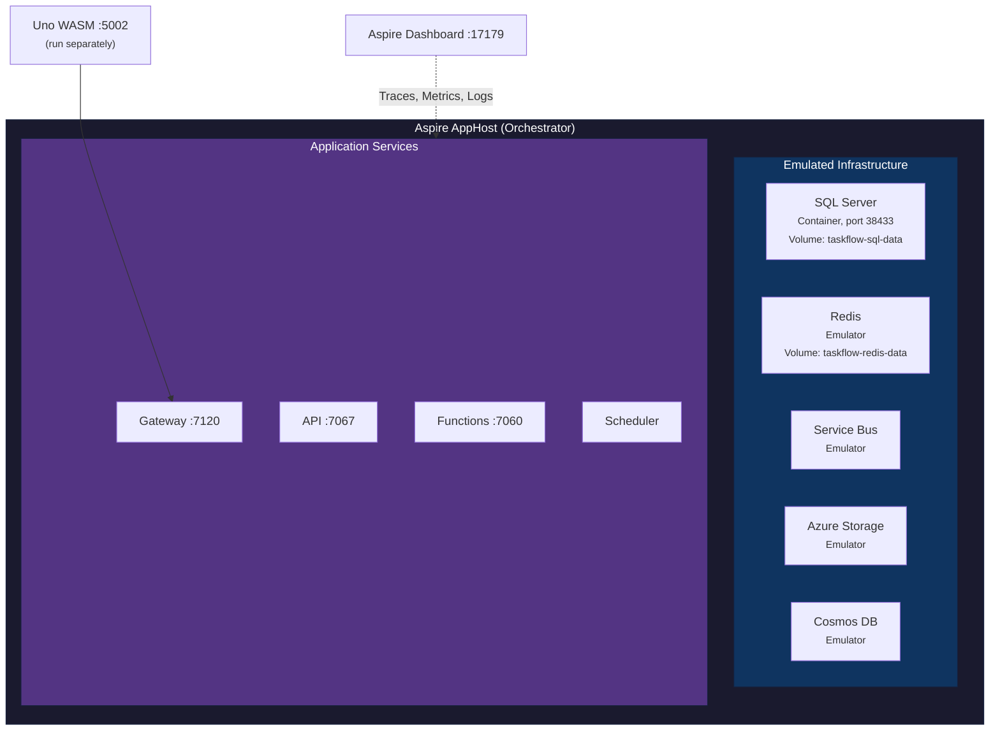

**Start locally**:
```bash
dotnet run --project src/Aspire/AppHost
# Uno WASM runs separately (Uno.Sdk constraint)
```

**Service dependencies**: API waits for SQL + Redis. Gateway waits for API. Functions wait for SQL + Storage.

### 9.2 Cloud Deployment (Azure)

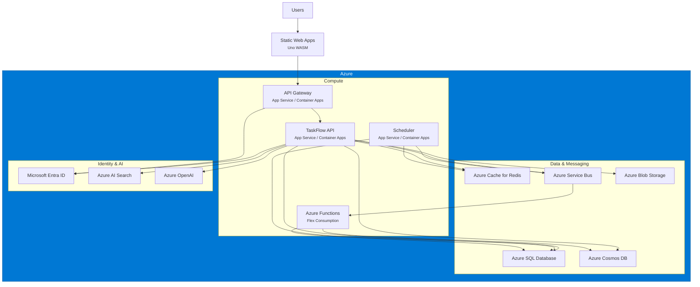

---

## 10. Observability

### 10.1 OpenTelemetry

Configured via **Aspire Service Defaults** (`Extensions.cs`):

| Signal | Instrumentation |
|--------|----------------|
| **Traces** | ASP.NET Core, HttpClient, custom spans |
| **Metrics** | ASP.NET Core, HttpClient, .NET Runtime, FusionCache |
| **Logs** | Structured logging with `IncludeFormattedMessage` + scopes |
| **Exporter** | OTLP (to Aspire Dashboard locally, Azure Monitor in cloud) |

### 10.2 Health Checks

| Endpoint | Source | Purpose | Checks |
|----------|--------|---------|--------|
| `/healthz` | ServiceDefaults | Liveness | All registered checks |
| `/readyz` | ServiceDefaults | Readiness | Checks tagged `"ready"` (SQL, Redis) |
| `/health` | API | Custom health check | SQL connectivity |
| `/alive` | API | Simple liveness | Always returns 200 |

### 10.3 Correlation Tracking

- `CorrelationIdMiddleware` generates or propagates `X-Correlation-Id` on every request
- Correlation ID flows through: HTTP headers → service calls → domain events → Function triggers → logs
- Enables end-to-end distributed tracing across all services

### 10.4 Aspire Dashboard

Locally at `http://localhost:17179`:
- Resource graph (all services + infra)
- Structured logs with filtering
- Distributed traces (request → service → database)
- Metrics (throughput, latency, errors)

---

## 11. Testing Strategy

### 11.1 Test Pyramid

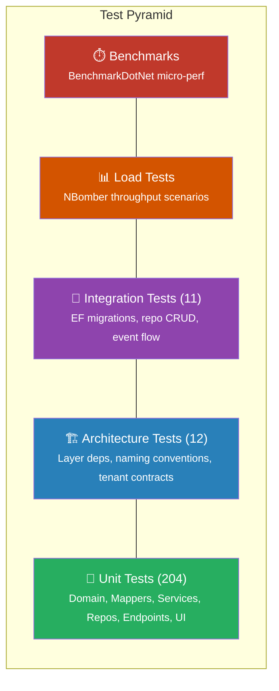

### 11.2 Test Projects

| Project | Count | Coverage |
|---------|-------|----------|
| **Test.Unit** | 204 | Domain entity logic, DTO mappers, service success/failure/conflict paths, in-memory SQLite repo CRUD, endpoint HTTP cycles (200/201/400/404/409/422), Uno API service mappers |
| **Test.Architecture** | 12 | Layer dependency rules, `ITenantEntity<Guid>` on all entities, interface conventions, private setters |
| **Test.Integration** | 11 | EF migrations, real repository CRUD, paging, domain events → Service Bus → projections |
| **Test.Load** | — | NBomber: task search throughput, CRUD scenarios (manual run) |
| **Test.Benchmarks** | — | BenchmarkDotNet: entity mapping perf, search projection perf (console runner) |
| **Test.E2E** | — | End-to-end (planned) |

### 11.3 Running Tests

```bash
# All unit + architecture tests
dotnet test --filter "TestCategory=Unit|TestCategory=Architecture"

# Integration tests (requires running infra)
dotnet test --filter "TestCategory=Integration"

# All tests
dotnet test
```

---

## 12. UI Architecture

### 12.1 Uno Platform WASM (Primary UI)

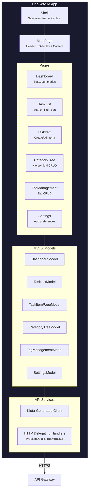

**Key patterns**:

| Pattern | Implementation |
|---------|---------------|
| **MVUX** | Uno's Model-View-Update-eXtended — reactive state management |
| **Kiota Client** | Auto-generated HTTP client from OpenAPI spec |
| **Mock Mode** | `Features:UseMocks=true` → canned 15-task dataset, no network calls |
| **Form Guard** | `IFormGuard` prevents navigation away from unsaved edits |
| **Navigation** | PanelVisibilityNavigator swaps sibling panels; detail pages push onto frame stack |

### 12.2 Blazor (Planned)

Project `TaskFlow.Blazor` exists as a stub for a future Blazor-based alternative UI.

### 12.3 Gateway as BFF

The YARP Gateway acts as a **Backend-for-Frontend (BFF)**:
- Handles user authentication (Entra ID or scaffold)
- Acquires service-to-service tokens for downstream API calls
- Strips `/gateway` prefix from routes
- Injects `X-Orig-Request` with user claims for the API
- CORS configured for UI origins

---

## Appendix: Azure Functions & Scheduler Details

### Azure Functions

| Function | Trigger | Binding | Purpose |
|----------|---------|---------|---------|
| `HealthCheck` | HTTP GET `/health` | Anonymous | Health probe |
| `TaskApiProxy` | HTTP GET `/tasks` | Function key | Read-only task query (placeholder) |
| `ProcessTaskEvent` | Service Bus Topic | `DomainEvents` topic, `function-processor` subscription | Projects task events to Cosmos DB read model |
| `ProcessAttachment` | Blob | Attachment container | Validates files, extracts metadata, updates Attachment record |
| `StaleTaskCleanup` | Timer | Config-driven cron | Deletes cancelled/stale tasks older than 90 days |

### Scheduler Jobs (TickerQ)

| Job | Schedule | Purpose |
|-----|----------|---------|
| `OverdueTaskCheck` | Every 6 hours | Finds overdue tasks → publishes `TaskItemOverdueSuspectedEvent` |
| `RecurringTaskGeneration` | Daily 2:00 AM UTC | Generates new task instances from recurring patterns |
| `StaleTaskCleanup` | Weekly Sunday 3:00 AM UTC | Archives/soft-deletes old cancelled tasks |

TickerQ uses an EF Core operational store (`TickerQDbContext`, schema `"ticker"`) for job persistence when `Scheduling:UsePersistence=true`.
